# 🔄 BookMyShow System Flow Diagrams

## 📋 Quick Navigation
- [System Architecture Flow](#system-architecture-flow)
- [Booking Process Flow](#booking-process-flow)
- [Design Patterns Flow](#design-patterns-flow)
- [Data Flow Diagrams](#data-flow-diagrams)
- [Error Handling Flow](#error-handling-flow)

---

## 🏗️ System Architecture Flow

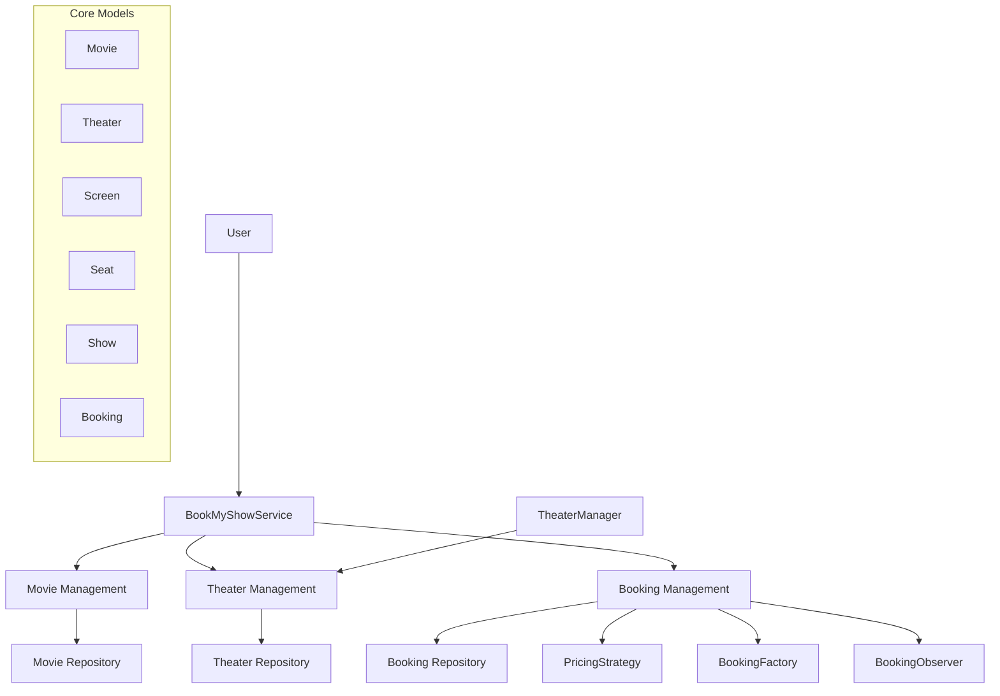

---

## 🎫 Booking Process Flow

### **Happy Path Flow:**
```
1. User Views Movies
   ↓
2. User Selects Movie
   ↓
3. System Shows Available Shows
   ↓
4. User Selects Show
   ↓
5. System Displays Seat Layout
   ↓
6. User Selects Seats
   ↓
7. System Validates Seat Availability
   ↓
8. System Calculates Price (Strategy Pattern)
   ↓
9. System Creates Booking (Factory Pattern)
   ↓
10. System Notifies Observers (Observer Pattern)
    ↓
11. User Confirms Booking
    ↓
12. System Updates Seat Status
    ↓
13. System Sends Confirmation
```

### **Detailed Booking Flow:**
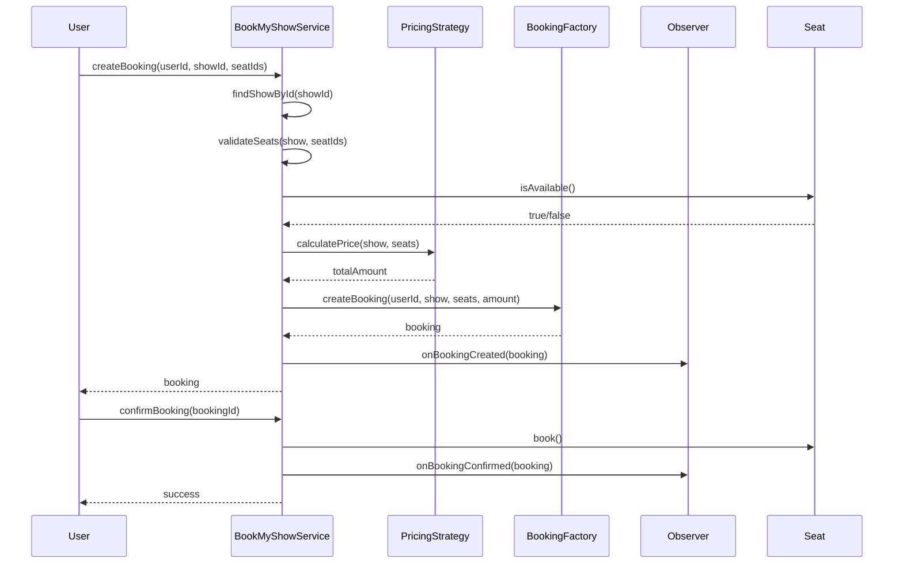

---

## 🎯 Design Patterns Flow

### **Strategy Pattern (Pricing):**
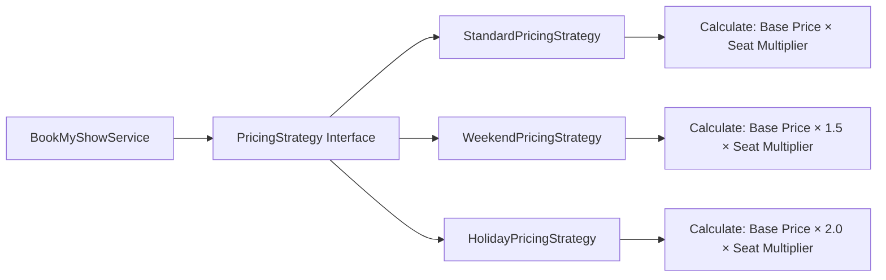

### **Factory Pattern (Booking Creation):**
```mermaid
graph TD
    A[Service Layer] --> B[BookingFactory]
    B --> C[Generate Booking ID]
    B --> D[Create Booking Object]
    B --> E[Set Initial Status]
    B --> F[Return Booking]
    
    C --> G[BMS-XXXXXXXX]
    D --> H[new Booking(...)]
    E --> I[Status: PENDING]
```

### **Observer Pattern (Notifications):**
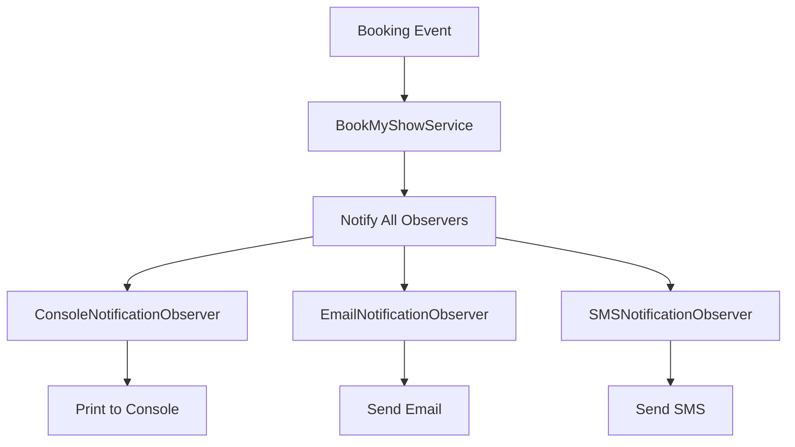

### **Singleton Pattern (Theater Manager):**
```mermaid
graph TD
    A[Multiple Clients] --> B[TheaterManager.getInstance()]
    B --> C{Instance Exists?}
    C -->|No| D[Create New Instance]
    C -->|Yes| E[Return Existing Instance]
    D --> F[Single TheaterManager Instance]
    E --> F
```

---

## 📊 Data Flow Diagrams

### **Level 0: Context Diagram**
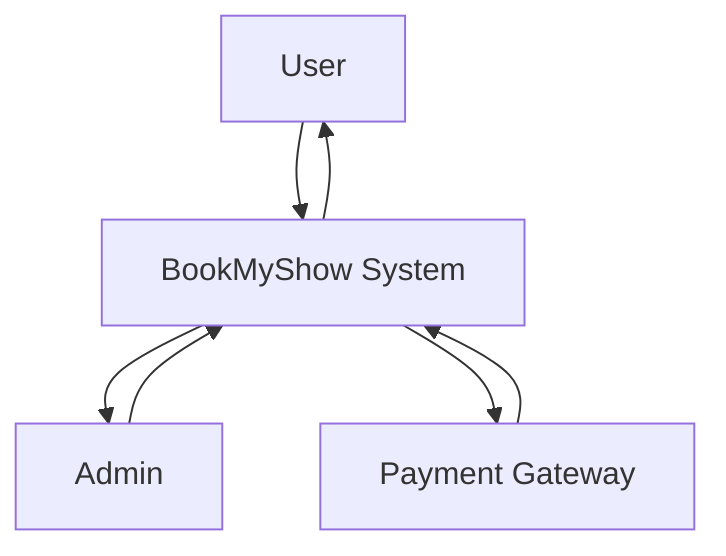

### **Level 1: System Breakdown**
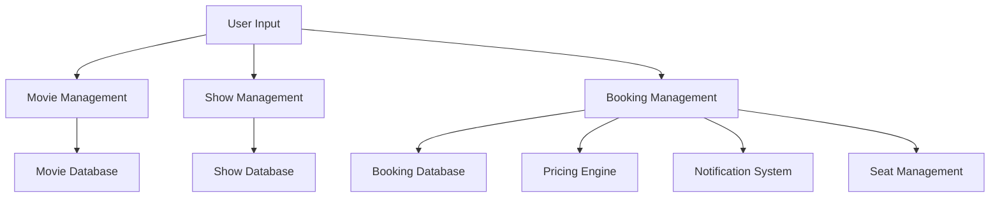

### **Level 2: Booking Process Detail**
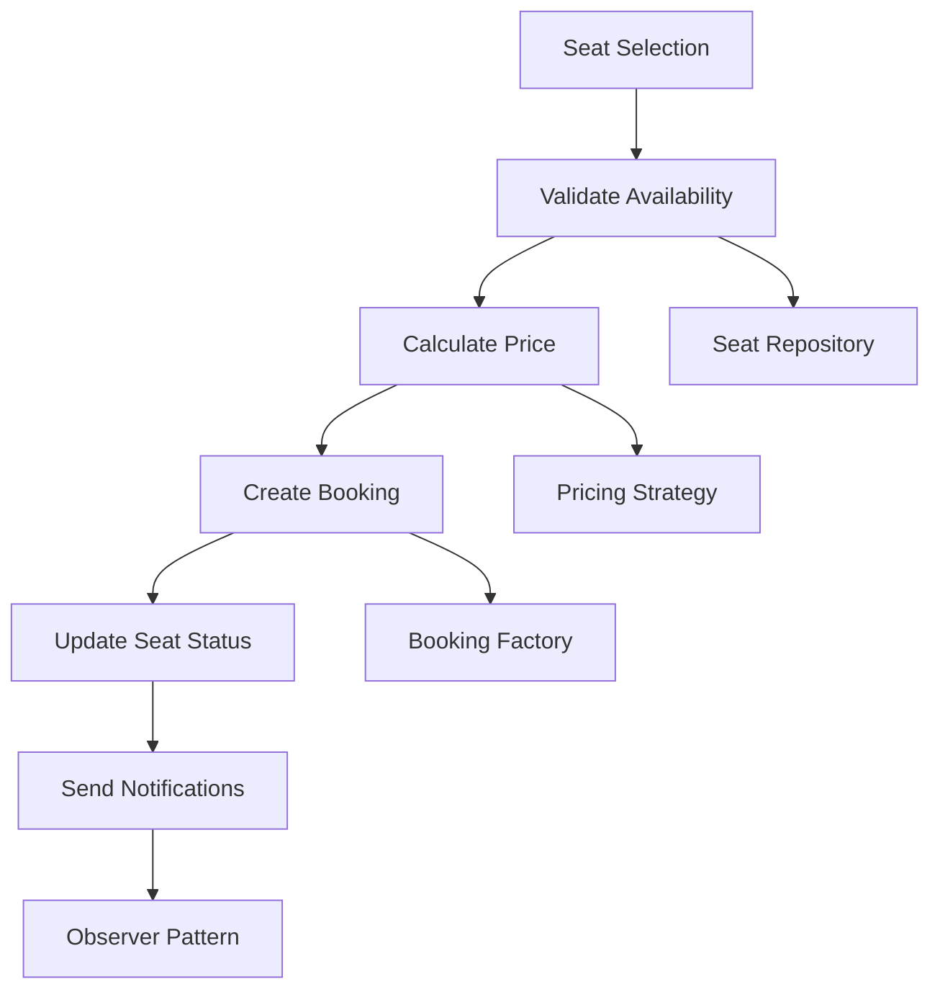

---

## ⚠️ Error Handling Flow

### **Seat Booking Error Flow:**
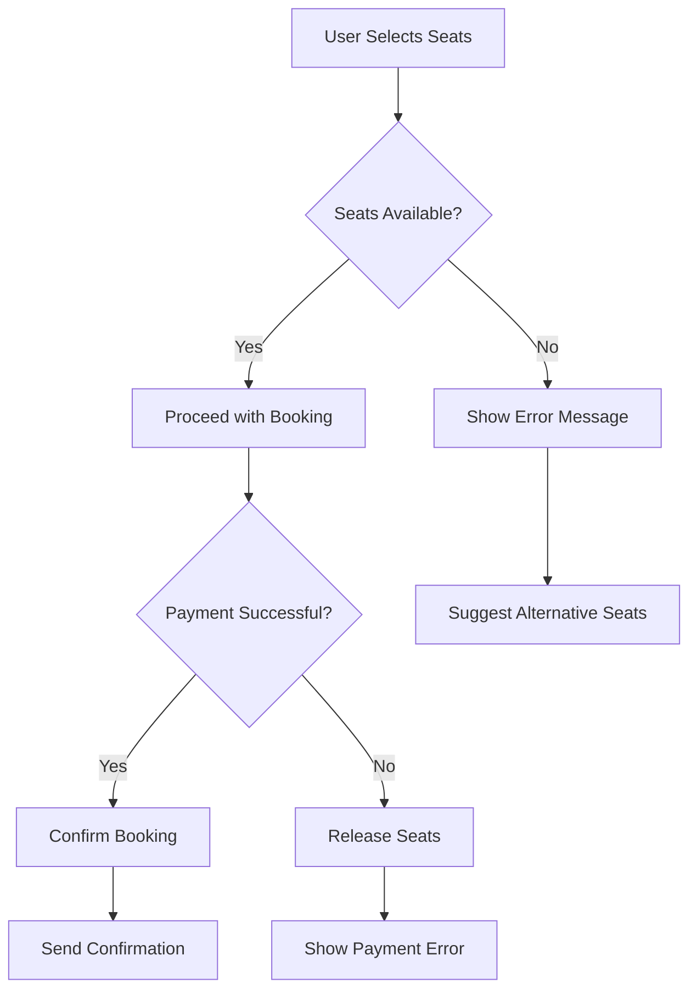

### **Concurrent Booking Handling:**
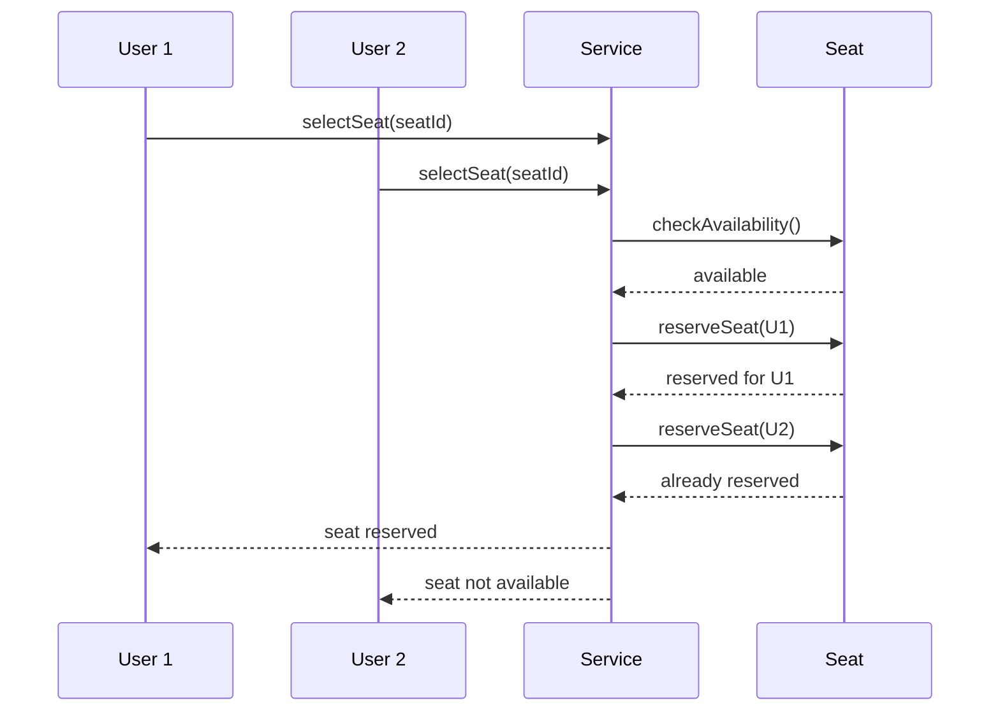

---

## 🔄 State Transition Diagrams

### **Seat State Transitions:**
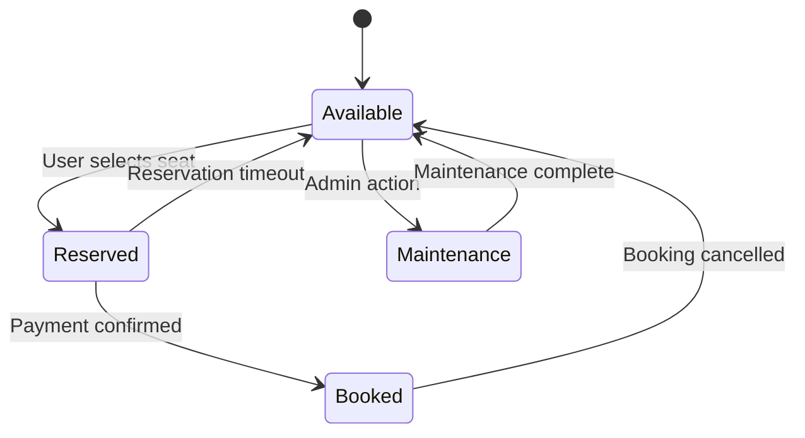

### **Booking State Transitions:**
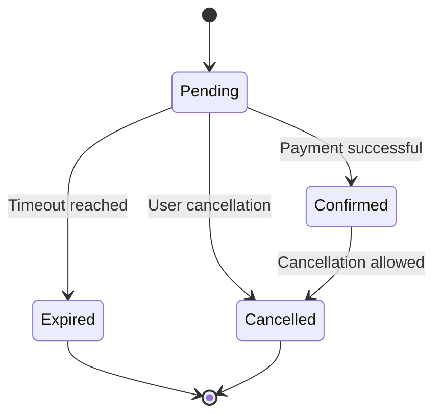

---

## 🎬 Show Management Flow

### **Show Creation Process:**
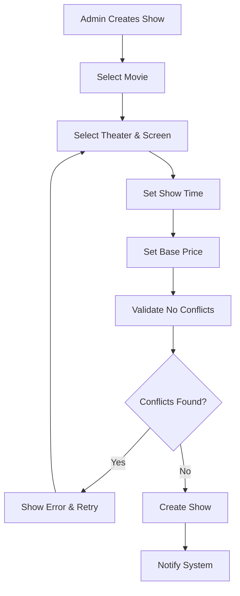

### **Show Availability Check:**
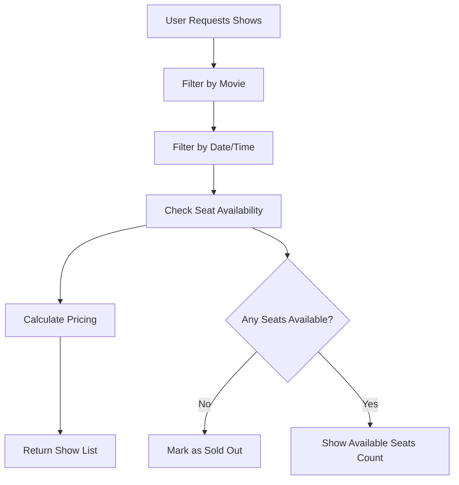

---

## 🏢 Multi-Theater Architecture

### **Theater Management Flow:**
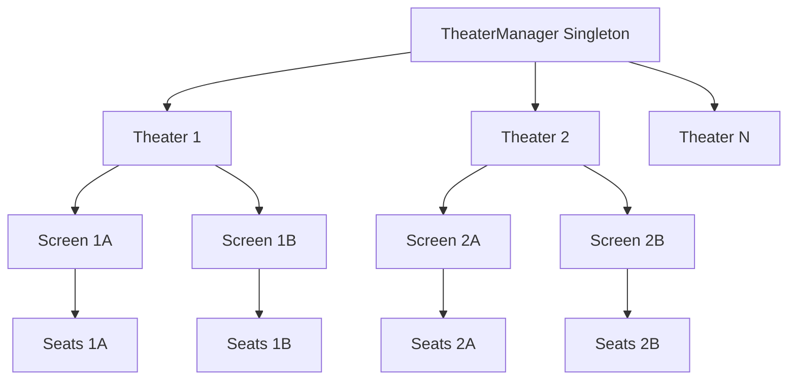

### **Cross-Theater Show Search:**
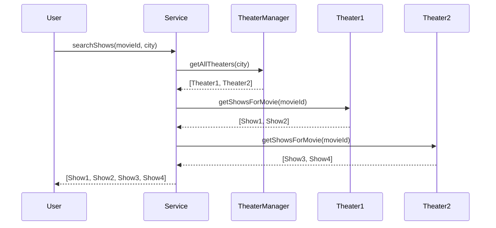

---

## 📱 Integration Points

### **External System Integration:**
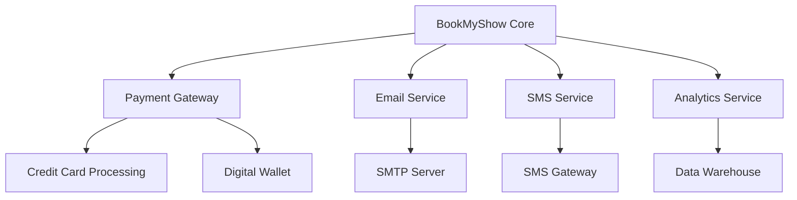

**These diagrams provide a comprehensive visual understanding of the BookMyShow system architecture and flows, perfect for interview discussions!**