# 🔄 Elevator Control System - Flow Diagrams

## 📋 Table of Contents
1. [System Architecture Overview](#system-architecture-overview)
2. [Request Processing Flow](#request-processing-flow)
3. [Elevator Movement Flow](#elevator-movement-flow)
4. [Design Patterns Interaction](#design-patterns-interaction)
5. [Thread Safety Flow](#thread-safety-flow)
6. [Extension Points Flow](#extension-points-flow)

---

## 🏗️ System Architecture Overview

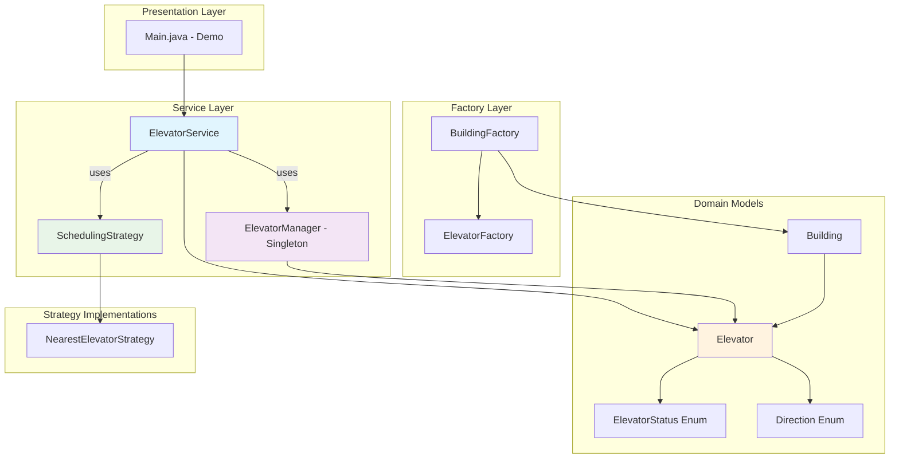

---

## 🎯 Request Processing Flow

### **External Request Flow (People Outside Elevator)**

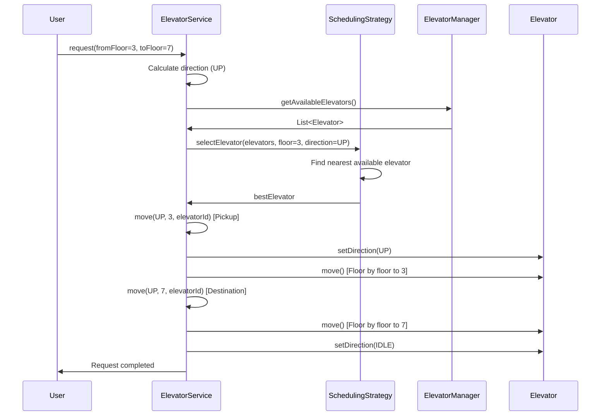

### **Internal Request Flow (People Inside Elevator)**

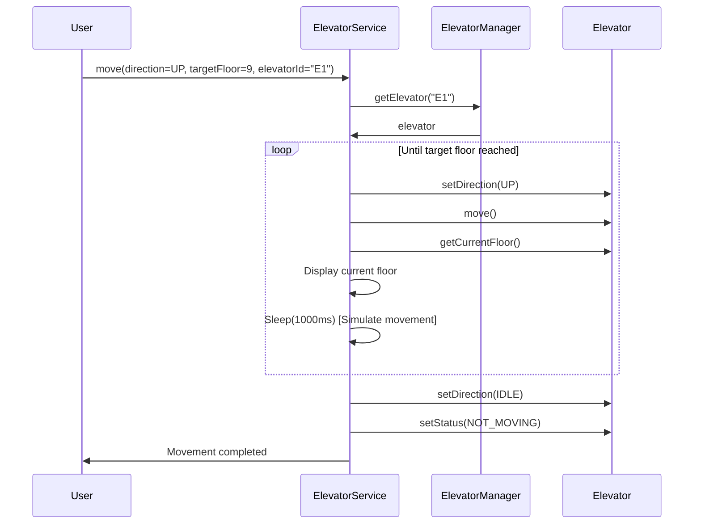

---

## 🚀 Elevator Movement Flow

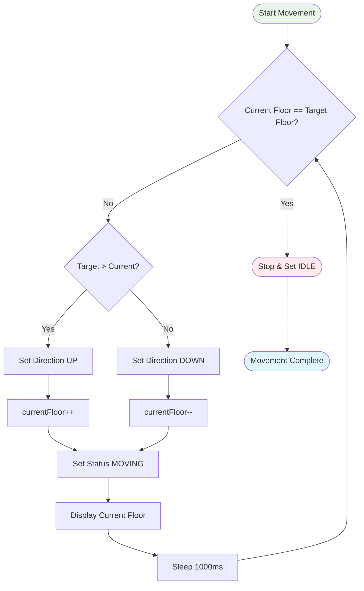

---

## 🎨 Design Patterns Interaction

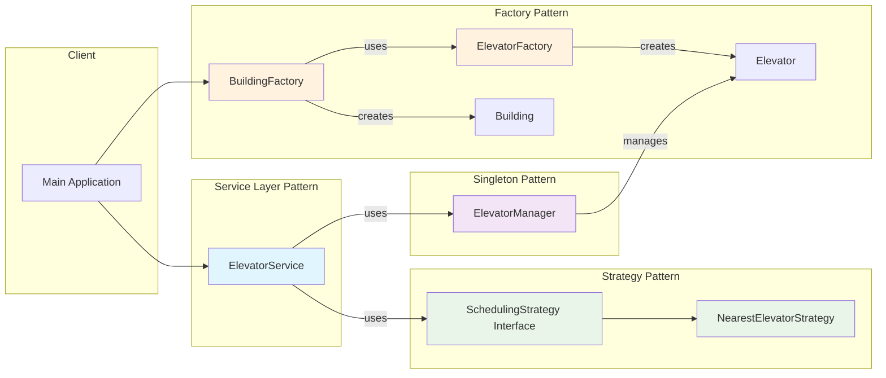

---

## 🔒 Thread Safety Flow

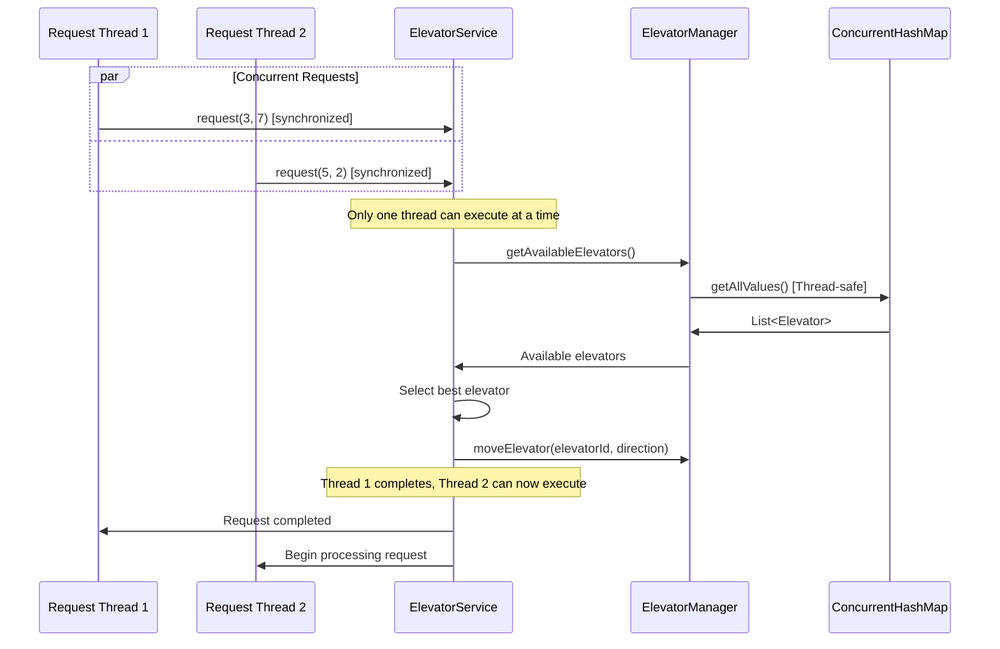

---

## 🔧 Extension Points Flow

### **Adding New Scheduling Strategy**

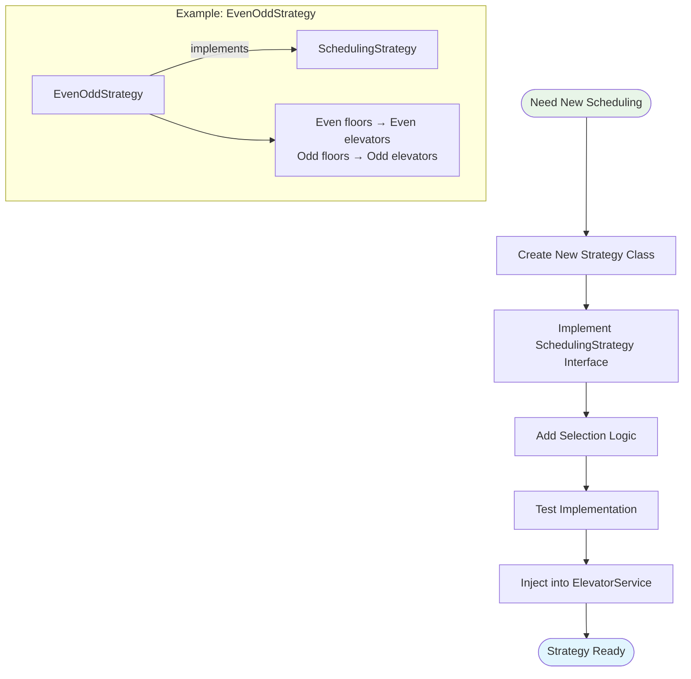

### **Adding Emergency Handling**

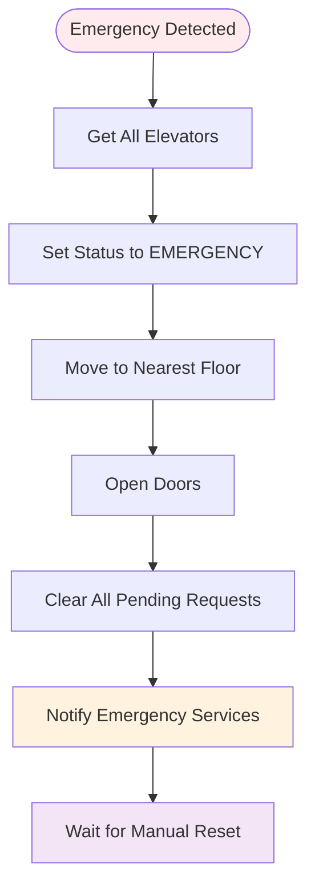

---

## 📊 System State Transitions

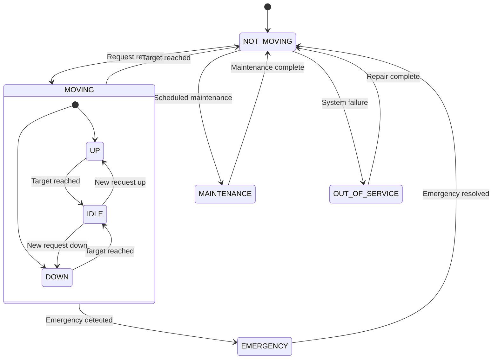

---

## 🎯 Performance Optimization Flow

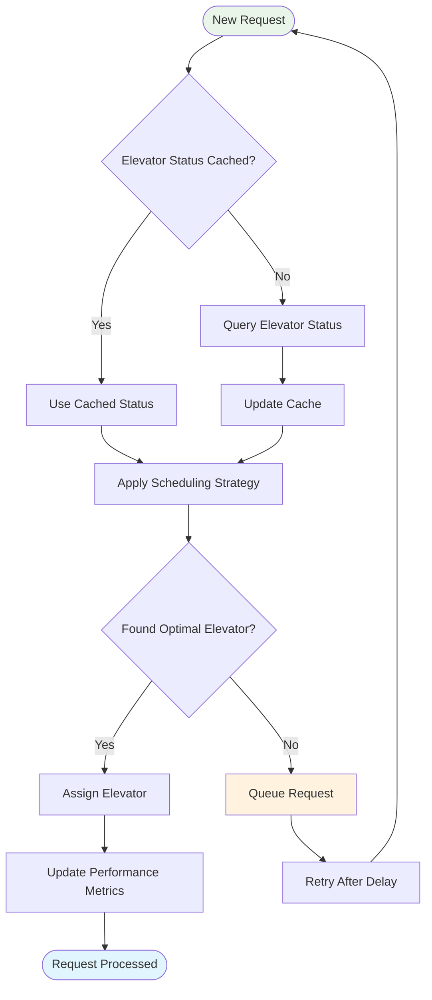

---

## 🔄 Scalability Architecture

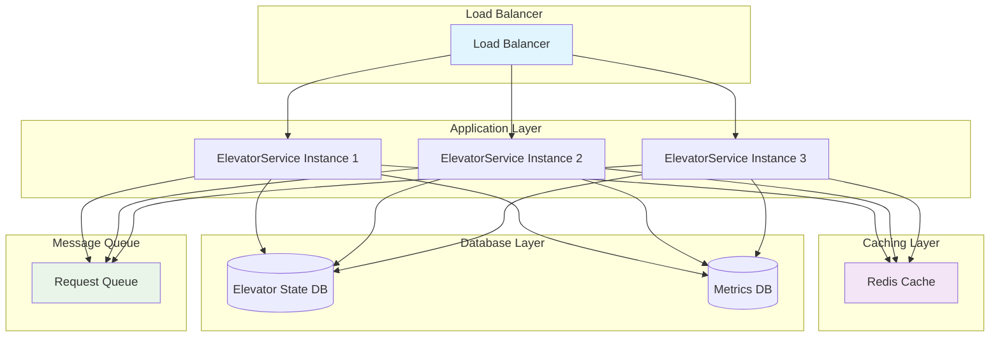

---

## 💡 Interview Discussion Points

### **When Explaining Architecture:**
- *"The service layer provides clean separation between business logic and data management"*
- *"Singleton pattern ensures single point of control for all elevators"*
- *"Strategy pattern allows different scheduling algorithms without code changes"*

### **When Discussing Scalability:**
- *"This architecture can easily scale to multiple buildings by extending ElevatorManager"*
- *"The service layer can be converted to REST APIs for distributed deployment"*
- *"Thread safety ensures the system can handle concurrent requests safely"*

### **When Showing Extensions:**
- *"Adding new elevator types just requires implementing the strategy interface"*
- *"Emergency handling can be added without modifying existing code"*
- *"Performance monitoring can be injected at any layer"*

**These diagrams demonstrate the system's clean architecture, extensibility, and production-ready design patterns!**