# 🔄 Food Delivery System Flow Diagrams

## 📋 Quick Navigation
- [System Architecture Flow](#system-architecture-flow)
- [Order Processing Flow](#order-processing-flow)
- [Delivery Assignment Flow](#delivery-assignment-flow)
- [Design Patterns Flow](#design-patterns-flow)
- [Data Flow Diagrams](#data-flow-diagrams)
- [Error Handling Flow](#error-handling-flow)

---

## 🏗️ System Architecture Flow

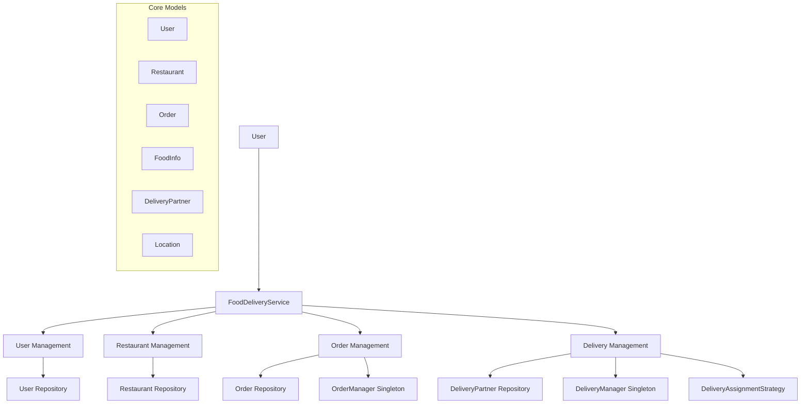
```mermaid
graph TD
    A[User] --> B[FoodDeliveryService]
    B --> C[User Management]
    B --> D[Restaurant Management]
    B --> E[Order Management]
    B --> F[Delivery Management]
    
    C --> G[User Repository]
    D --> H[Restaurant Repository]
    E --> I[Order Repository]
    F --> J[DeliveryPartner Repository]
    
    E --> K[OrderManager Singleton]
    F --> L[DeliveryManager Singleton]
    F --> M[DeliveryAssignmentStrategy]
    
    subgraph "Core Models"
        N[User]
        O[Restaurant]
        P[Order]
        Q[FoodInfo]
        R[DeliveryPartner]
        S[Location]
    end
```

---

## 🍕 Order Processing Flow

### **Happy Path Flow:**
```
1. Customer Views Restaurants
   ↓
2. Customer Selects Restaurant
   ↓
3. System Shows Restaurant Menu
   ↓
4. Customer Adds Items to Cart
   ↓
5. Customer Places Order
   ↓
6. System Validates Order Items
   ↓
7. System Calculates Total Amount
   ↓
8. System Creates Order (Factory Pattern)
   ↓
9. Customer Confirms Order
   ↓
10. System Updates Order Status
    ↓
11. Restaurant Prepares Order
    ↓
12. System Assigns Delivery Partner (Strategy Pattern)
    ↓
13. Delivery Partner Picks Up Order
    ↓
14. Order Delivered to Customer
```

### **Detailed Order Processing Flow:**
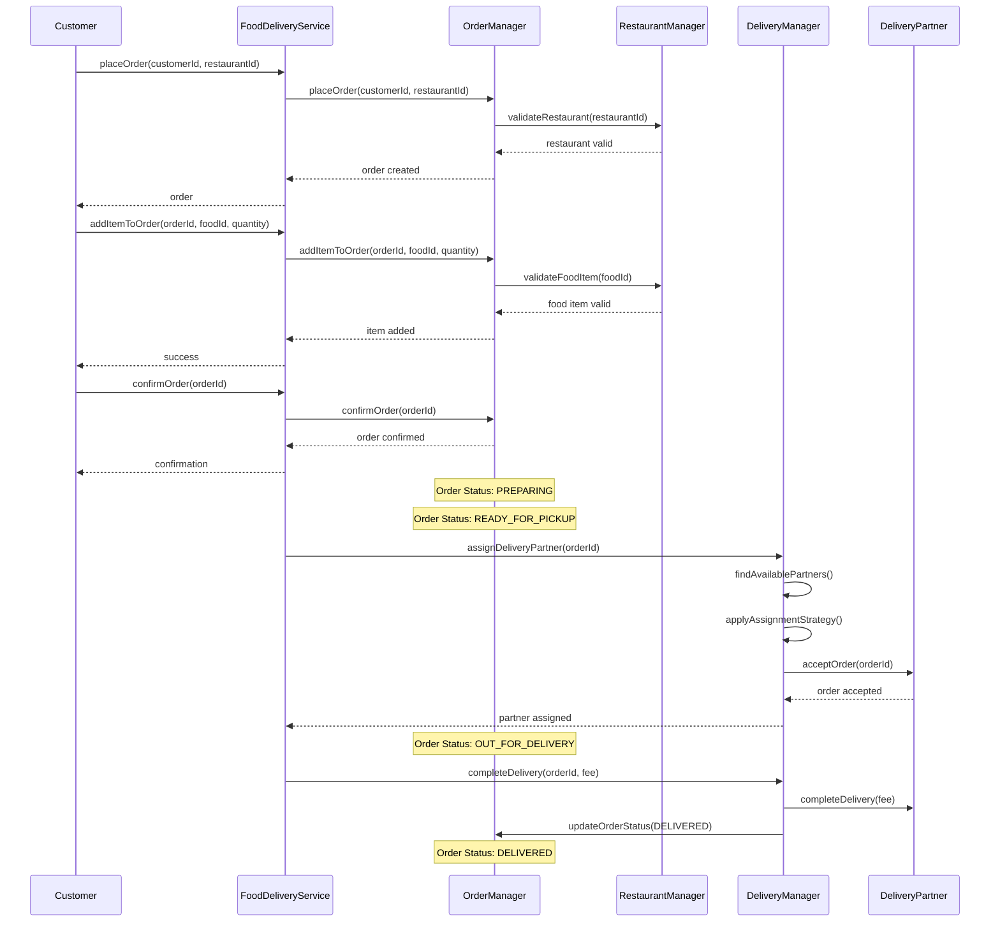
```mermaid
sequenceDiagram
    participant C as Customer
    participant S as FoodDeliveryService
    participant OM as OrderManager
    participant RM as RestaurantManager
    participant DM as DeliveryManager
    participant DP as DeliveryPartner

    C->>S: placeOrder(customerId, restaurantId)
    S->>OM: placeOrder(customerId, restaurantId)
    OM->>RM: validateRestaurant(restaurantId)
    RM-->>OM: restaurant valid
    OM-->>S: order created
    S-->>C: order

    C->>S: addItemToOrder(orderId, foodId, quantity)
    S->>OM: addItemToOrder(orderId, foodId, quantity)
    OM->>RM: validateFoodItem(foodId)
    RM-->>OM: food item valid
    OM-->>S: item added
    S-->>C: success

    C->>S: confirmOrder(orderId)
    S->>OM: confirmOrder(orderId)
    OM-->>S: order confirmed
    S-->>C: confirmation

    Note over OM: Order Status: PREPARING
    Note over OM: Order Status: READY_FOR_PICKUP

    S->>DM: assignDeliveryPartner(orderId)
    DM->>DM: findAvailablePartners()
    DM->>DM: applyAssignmentStrategy()
    DM->>DP: acceptOrder(orderId)
    DP-->>DM: order accepted
    DM-->>S: partner assigned
    
    Note over OM: Order Status: OUT_FOR_DELIVERY
    
    S->>DM: completeDelivery(orderId, fee)
    DM->>DP: completeDelivery(fee)
    DM->>OM: updateOrderStatus(DELIVERED)
    
    Note over OM: Order Status: DELIVERED
```

---

## 🚚 Delivery Assignment Flow

### **Strategy Pattern Implementation:**
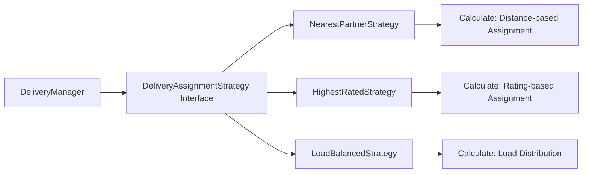
```mermaid
graph LR
    A[DeliveryManager] --> B[DeliveryAssignmentStrategy Interface]
    B --> C[NearestPartnerStrategy]
    B --> D[HighestRatedStrategy]
    B --> E[LoadBalancedStrategy]
    
    C --> F[Calculate: Distance-based Assignment]
    D --> G[Calculate: Rating-based Assignment]
    E --> H[Calculate: Load Distribution]
```

### **Delivery Assignment Process:**
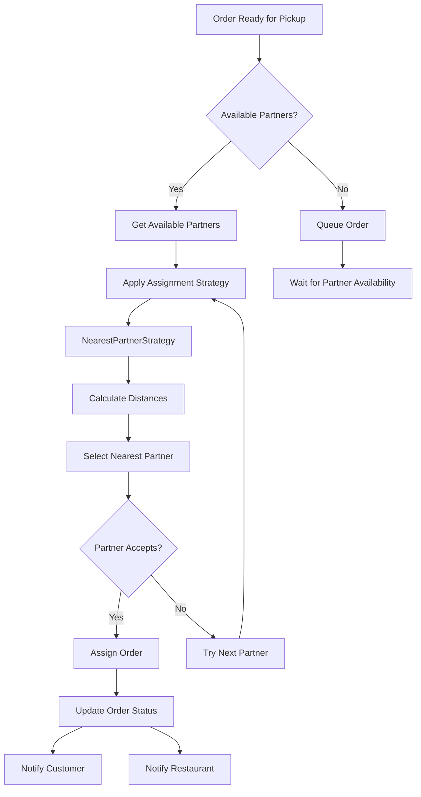
```mermaid
graph TD
    A[Order Ready for Pickup] --> B{Available Partners?}
    B -->|No| C[Queue Order]
    B -->|Yes| D[Get Available Partners]
    
    D --> E[Apply Assignment Strategy]
    E --> F[NearestPartnerStrategy]
    F --> G[Calculate Distances]
    G --> H[Select Nearest Partner]
    
    H --> I{Partner Accepts?}
    I -->|Yes| J[Assign Order]
    I -->|No| K[Try Next Partner]
    
    J --> L[Update Order Status]
    L --> M[Notify Customer]
    L --> N[Notify Restaurant]
    
    K --> E
    C --> O[Wait for Partner Availability]
```

### **Distance Calculation Flow:**
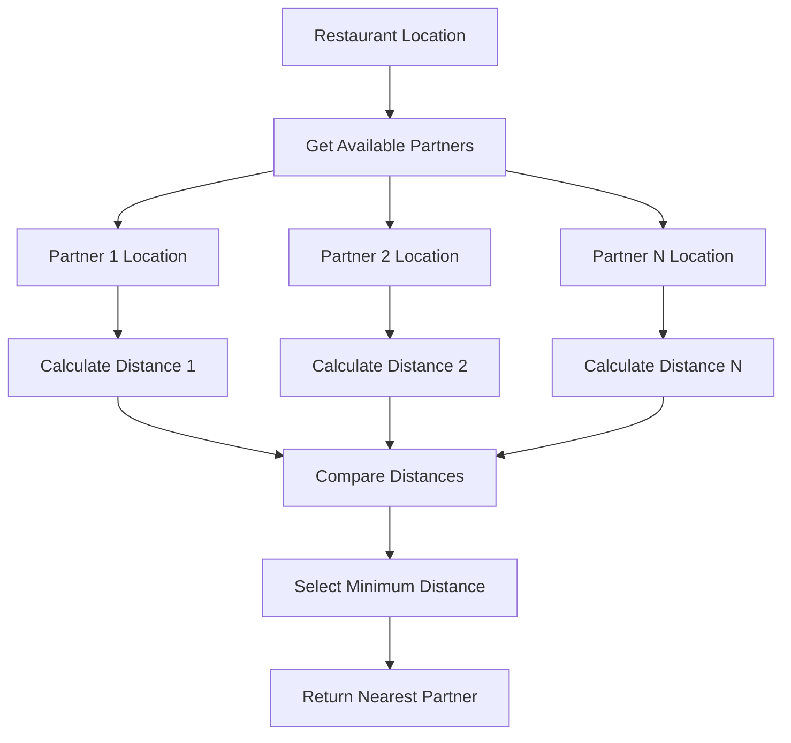
```mermaid
graph TD
    A[Restaurant Location] --> B[Get Available Partners]
    B --> C[Partner 1 Location]
    B --> D[Partner 2 Location]
    B --> E[Partner N Location]
    
    C --> F[Calculate Distance 1]
    D --> G[Calculate Distance 2]
    E --> H[Calculate Distance N]
    
    F --> I[Compare Distances]
    G --> I
    H --> I
    
    I --> J[Select Minimum Distance]
    J --> K[Return Nearest Partner]
```

---

## 🎯 Design Patterns Flow

### **Singleton Pattern (Managers):**
```mermaid
graph TD
    A[Multiple Service Calls] --> B[OrderManager.getInstance()]
    B --> C{Instance Exists?}
    C -->|No| D[Create New Instance]
    C -->|Yes| E[Return Existing Instance]
    D --> F[Single OrderManager Instance]
    E --> F
    
    G[Multiple Delivery Calls] --> H[DeliveryManager.getInstance()]
    H --> I{Instance Exists?}
    I -->|No| J[Create New Instance]
    I -->|Yes| K[Return Existing Instance]
    J --> L[Single DeliveryManager Instance]
    K --> L
```

### **Strategy Pattern (Delivery Assignment):**
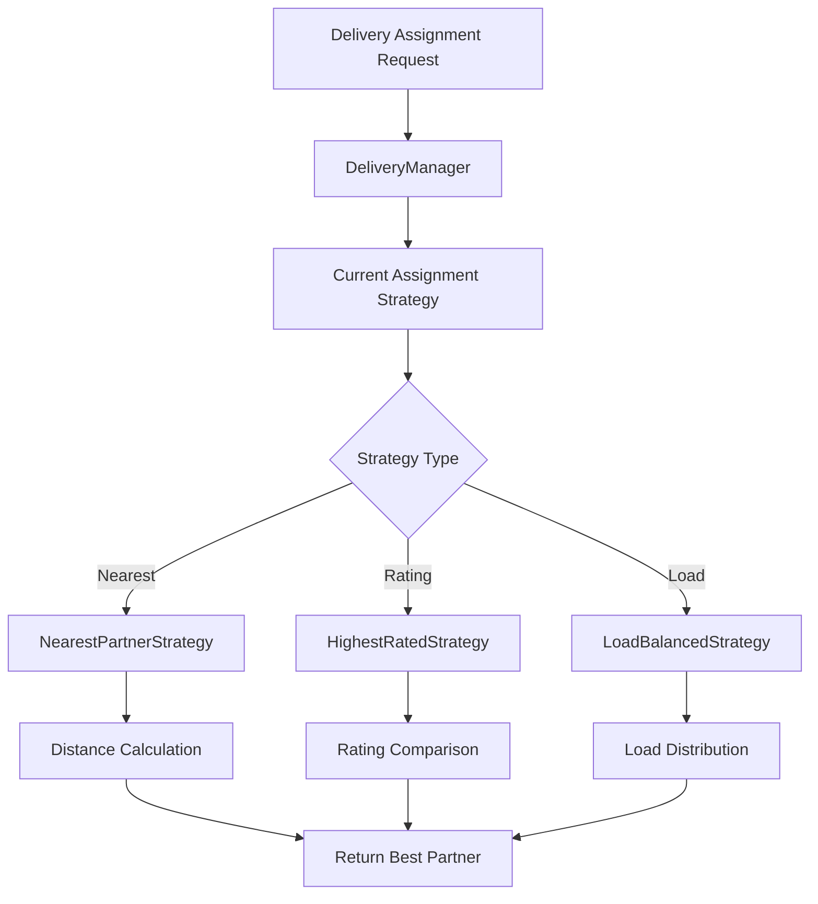
```mermaid
graph TD
    A[Delivery Assignment Request] --> B[DeliveryManager]
    B --> C[Current Assignment Strategy]
    
    C --> D{Strategy Type}
    D -->|Nearest| E[NearestPartnerStrategy]
    D -->|Rating| F[HighestRatedStrategy]
    D -->|Load| G[LoadBalancedStrategy]
    
    E --> H[Distance Calculation]
    F --> I[Rating Comparison]
    G --> J[Load Distribution]
    
    H --> K[Return Best Partner]
    I --> K
    J --> K
```

### **Factory Pattern (Order Creation):**
```mermaid
graph TD
    A[Service Layer] --> B[Order Creation Request]
    B --> C[OrderManager]
    C --> D[Generate Order ID]
    C --> E[Create Order Object]
    C --> F[Set Initial Status]
    C --> G[Return Order]
    
    D --> H[ORD_XXXXXXXX]
    E --> I[new Order(...)]
    F --> J[Status: PLACED]
```

---

## 📊 Data Flow Diagrams

### **Level 0: Context Diagram**
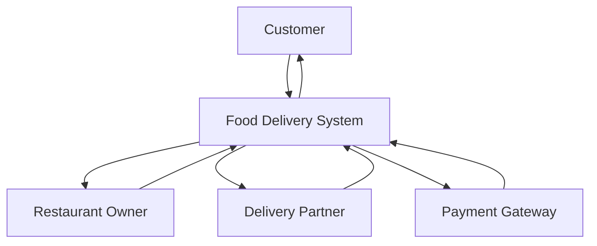
```mermaid
graph TD
    A[Customer] --> B[Food Delivery System]
    B --> A
    C[Restaurant Owner] --> B
    B --> C
    D[Delivery Partner] --> B
    B --> D
    E[Payment Gateway] --> B
    B --> E
```

### **Level 1: System Breakdown**
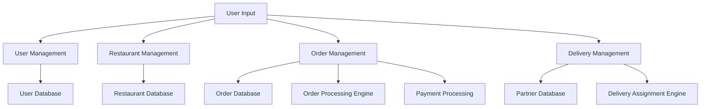
```mermaid
graph TD
    A[User Input] --> B[User Management]
    A --> C[Restaurant Management]
    A --> D[Order Management]
    A --> E[Delivery Management]
    
    B --> F[User Database]
    C --> G[Restaurant Database]
    D --> H[Order Database]
    E --> I[Partner Database]
    
    D --> J[Order Processing Engine]
    E --> K[Delivery Assignment Engine]
    D --> L[Payment Processing]
```

### **Level 2: Order Processing Detail**
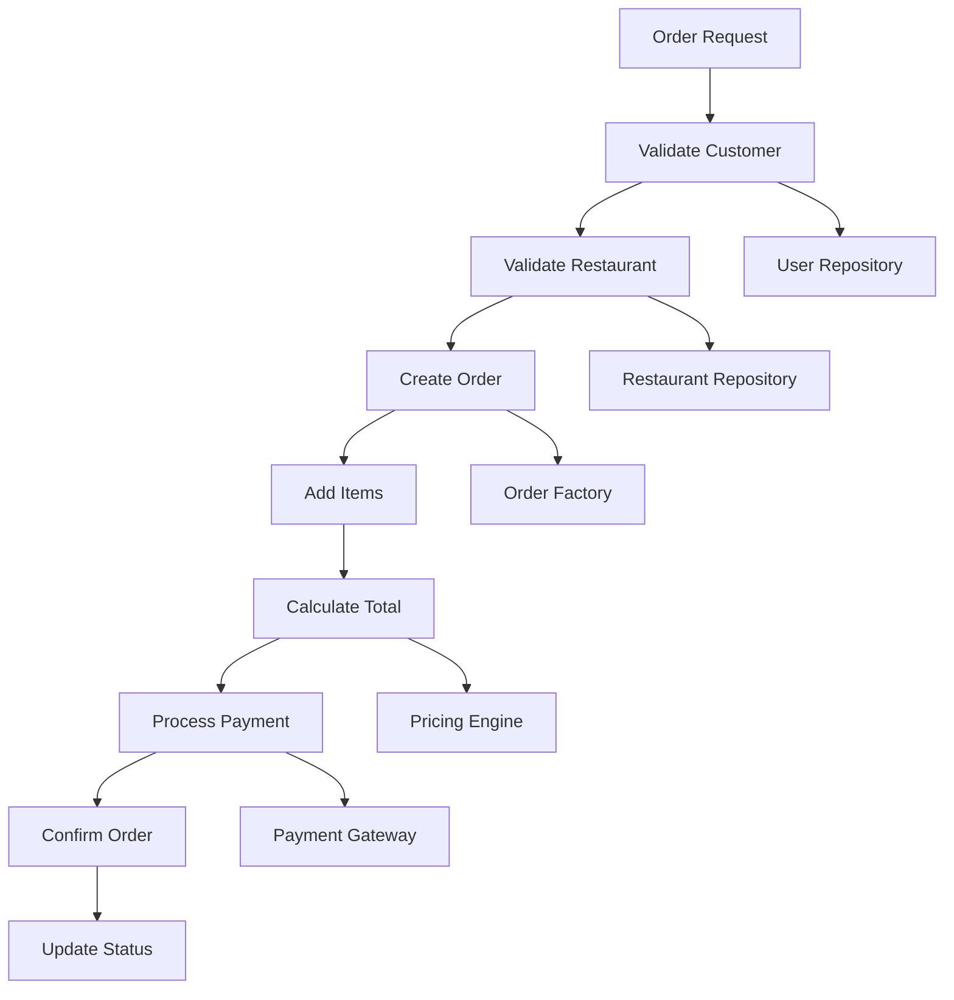
```mermaid
graph TD
    A[Order Request] --> B[Validate Customer]
    B --> C[Validate Restaurant]
    C --> D[Create Order]
    D --> E[Add Items]
    E --> F[Calculate Total]
    F --> G[Process Payment]
    G --> H[Confirm Order]
    H --> I[Update Status]
    
    B --> J[User Repository]
    C --> K[Restaurant Repository]
    D --> L[Order Factory]
    F --> M[Pricing Engine]
    G --> N[Payment Gateway]
```

---

## ⚠️ Error Handling Flow

### **Order Placement Error Flow:**
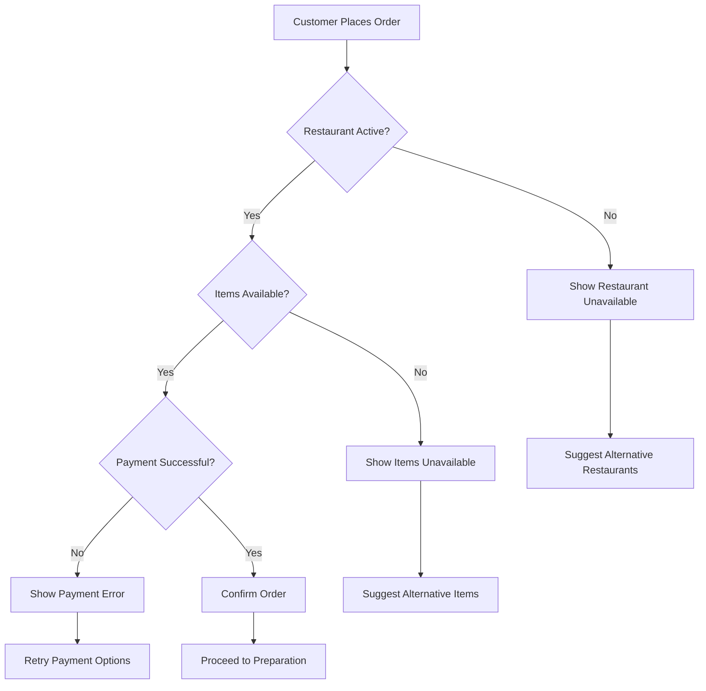
```mermaid
graph TD
    A[Customer Places Order] --> B{Restaurant Active?}
    B -->|No| C[Show Restaurant Unavailable]
    B -->|Yes| D{Items Available?}
    
    D -->|No| E[Show Items Unavailable]
    D -->|Yes| F{Payment Successful?}
    
    F -->|No| G[Show Payment Error]
    F -->|Yes| H[Confirm Order]
    
    C --> I[Suggest Alternative Restaurants]
    E --> J[Suggest Alternative Items]
    G --> K[Retry Payment Options]
    H --> L[Proceed to Preparation]
```

### **Delivery Assignment Error Flow:**
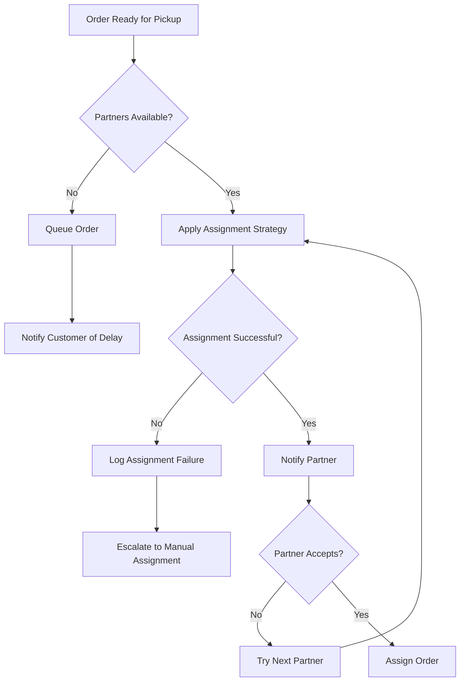
```mermaid
graph TD
    A[Order Ready for Pickup] --> B{Partners Available?}
    B -->|No| C[Queue Order]
    B -->|Yes| D[Apply Assignment Strategy]
    
    D --> E{Assignment Successful?}
    E -->|No| F[Log Assignment Failure]
    E -->|Yes| G[Notify Partner]
    
    G --> H{Partner Accepts?}
    H -->|No| I[Try Next Partner]
    H -->|Yes| J[Assign Order]
    
    C --> K[Notify Customer of Delay]
    F --> L[Escalate to Manual Assignment]
    I --> D
```

### **Concurrent Order Handling:**
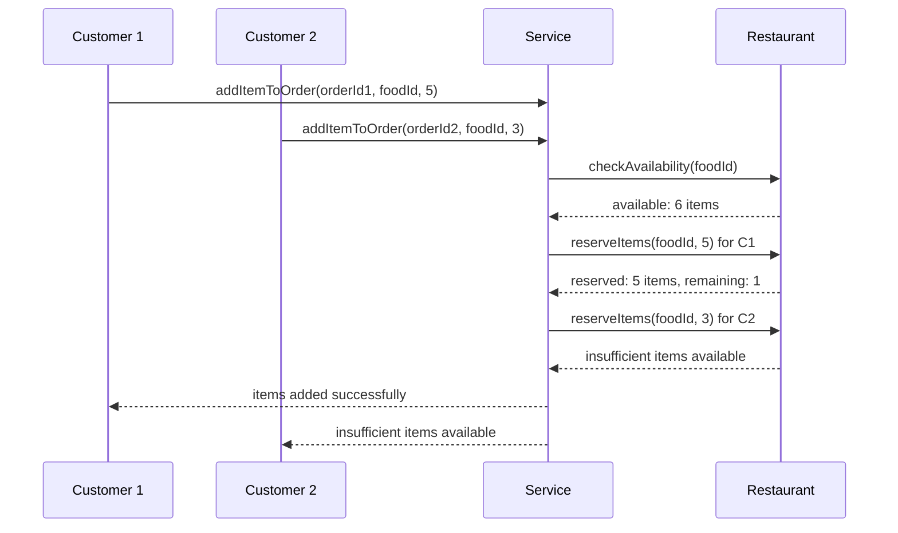
```mermaid
sequenceDiagram
    participant C1 as Customer 1
    participant C2 as Customer 2
    participant S as Service
    participant R as Restaurant

    C1->>S: addItemToOrder(orderId1, foodId, 5)
    C2->>S: addItemToOrder(orderId2, foodId, 3)
    
    S->>R: checkAvailability(foodId)
    R-->>S: available: 6 items
    
    S->>R: reserveItems(foodId, 5) for C1
    R-->>S: reserved: 5 items, remaining: 1
    
    S->>R: reserveItems(foodId, 3) for C2
    R-->>S: insufficient items available
    
    S-->>C1: items added successfully
    S-->>C2: insufficient items available
```

---

## 🔄 State Transition Diagrams

### **Order State Transitions:**
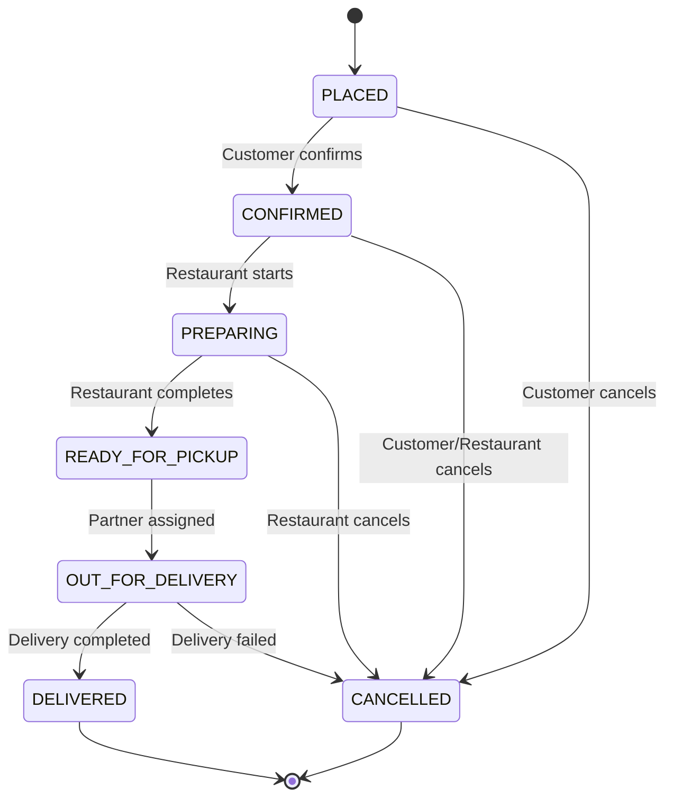
```mermaid
stateDiagram-v2
    [*] --> PLACED
    PLACED --> CONFIRMED : Customer confirms
    PLACED --> CANCELLED : Customer cancels
    CONFIRMED --> PREPARING : Restaurant starts
    CONFIRMED --> CANCELLED : Customer/Restaurant cancels
    PREPARING --> READY_FOR_PICKUP : Restaurant completes
    PREPARING --> CANCELLED : Restaurant cancels
    READY_FOR_PICKUP --> OUT_FOR_DELIVERY : Partner assigned
    OUT_FOR_DELIVERY --> DELIVERED : Delivery completed
    OUT_FOR_DELIVERY --> CANCELLED : Delivery failed
    DELIVERED --> [*]
    CANCELLED --> [*]
```

### **Delivery Partner State Transitions:**
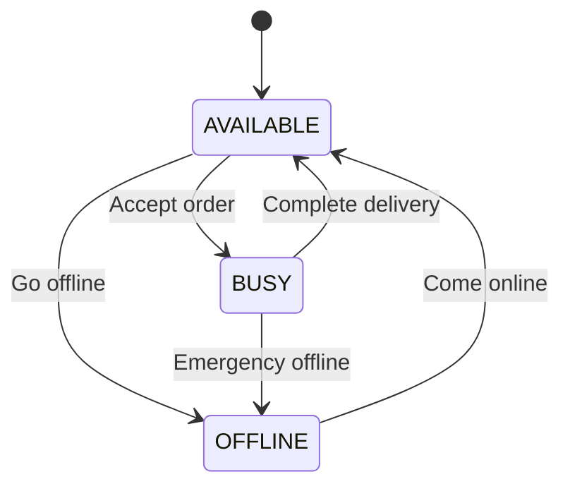
```mermaid
stateDiagram-v2
    [*] --> AVAILABLE
    AVAILABLE --> BUSY : Accept order
    BUSY --> AVAILABLE : Complete delivery
    AVAILABLE --> OFFLINE : Go offline
    OFFLINE --> AVAILABLE : Come online
    BUSY --> OFFLINE : Emergency offline
```

---

## 🍕 Restaurant Order Management Flow

### **Restaurant Order Processing:**
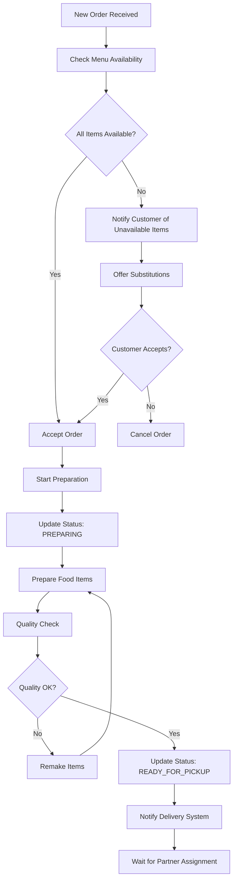
```mermaid
graph TD
    A[New Order Received] --> B[Check Menu Availability]
    B --> C{All Items Available?}
    C -->|No| D[Notify Customer of Unavailable Items]
    C -->|Yes| E[Accept Order]
    
    E --> F[Start Preparation]
    F --> G[Update Status: PREPARING]
    G --> H[Prepare Food Items]
    H --> I[Quality Check]
    I --> J{Quality OK?}
    
    J -->|No| K[Remake Items]
    J -->|Yes| L[Update Status: READY_FOR_PICKUP]
    
    K --> H
    L --> M[Notify Delivery System]
    M --> N[Wait for Partner Assignment]
    
    D --> O[Offer Substitutions]
    O --> P{Customer Accepts?}
    P -->|Yes| E
    P -->|No| Q[Cancel Order]
```

### **Menu Management Flow:**
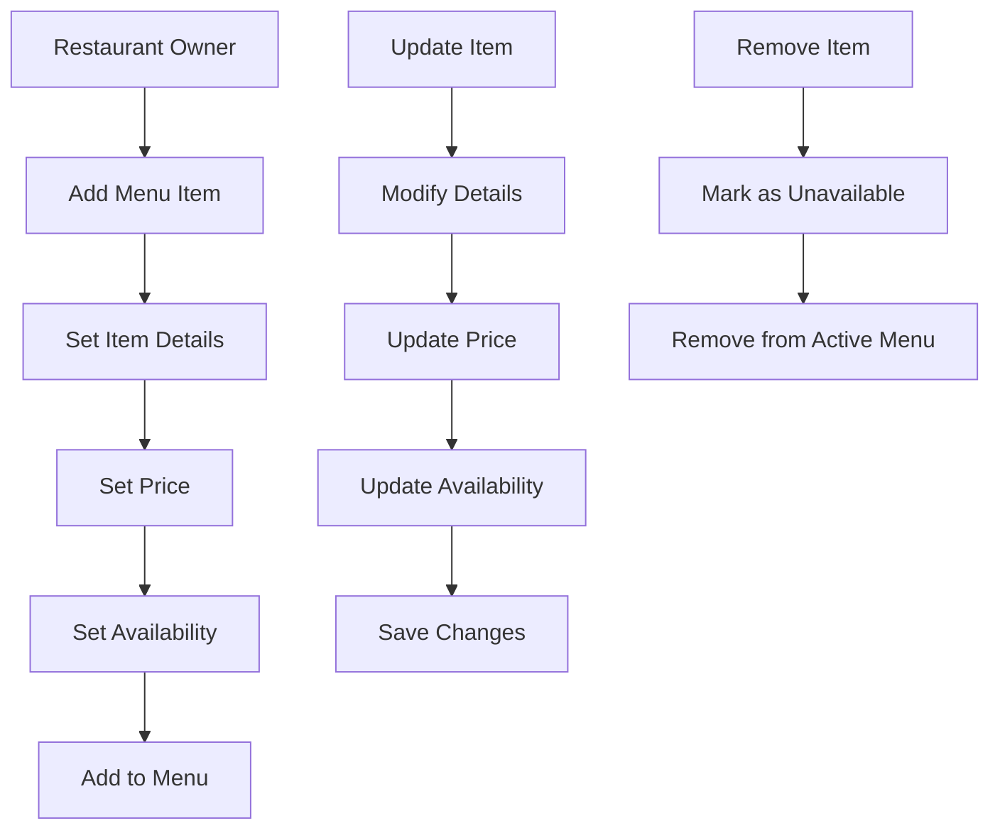
```mermaid
graph TD
    A[Restaurant Owner] --> B[Add Menu Item]
    B --> C[Set Item Details]
    C --> D[Set Price]
    D --> E[Set Availability]
    E --> F[Add to Menu]
    
    G[Update Item] --> H[Modify Details]
    H --> I[Update Price]
    I --> J[Update Availability]
    J --> K[Save Changes]
    
    L[Remove Item] --> M[Mark as Unavailable]
    M --> N[Remove from Active Menu]
```

---

## 📱 Real-time Updates Flow

### **Order Status Updates:**
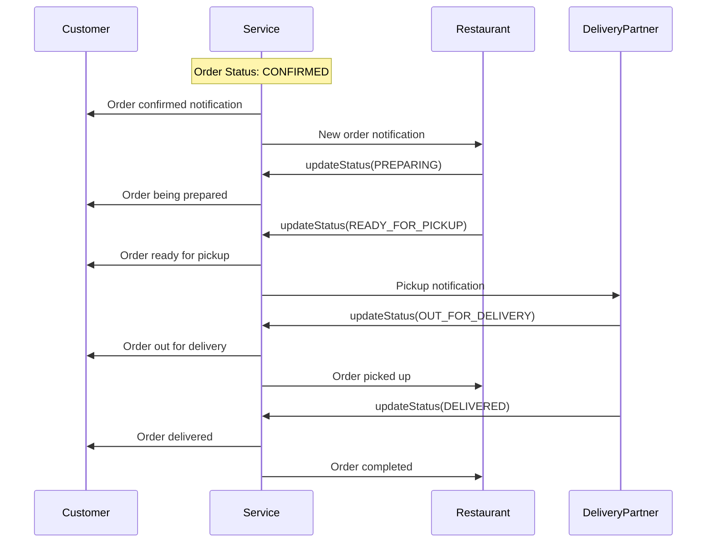
```mermaid
sequenceDiagram
    participant C as Customer
    participant S as Service
    participant R as Restaurant
    participant DP as DeliveryPartner

    Note over S: Order Status: CONFIRMED
    S->>C: Order confirmed notification
    S->>R: New order notification

    R->>S: updateStatus(PREPARING)
    S->>C: Order being prepared

    R->>S: updateStatus(READY_FOR_PICKUP)
    S->>C: Order ready for pickup
    S->>DP: Pickup notification

    DP->>S: updateStatus(OUT_FOR_DELIVERY)
    S->>C: Order out for delivery
    S->>R: Order picked up

    DP->>S: updateStatus(DELIVERED)
    S->>C: Order delivered
    S->>R: Order completed
```

### **Location Tracking Flow:**
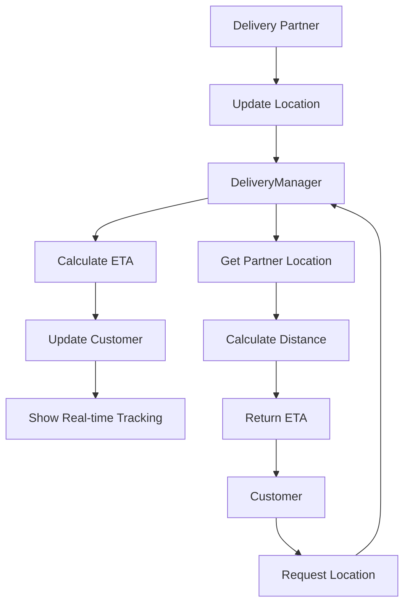
```mermaid
graph TD
    A[Delivery Partner] --> B[Update Location]
    B --> C[DeliveryManager]
    C --> D[Calculate ETA]
    D --> E[Update Customer]
    E --> F[Show Real-time Tracking]
    
    G[Customer] --> H[Request Location]
    H --> C
    C --> I[Get Partner Location]
    I --> J[Calculate Distance]
    J --> K[Return ETA]
    K --> G
```

---

## 🔧 Integration Points

### **External System Integration:**
```mermaid
graph TD
    A[Food Delivery Core] --> B[Payment Gateway]
    A --> C[SMS Service]
    A --> D[Email Service]
    A --> E[Maps API]
    A --> F[Analytics Service]
    
    B --> G[Credit Card Processing]
    B --> H[Digital Wallet]
    B --> I[Cash on Delivery]
    
    C --> J[SMS Gateway]
    D --> K[SMTP Server]
    E --> L[Google Maps API]
    F --> M[Data Warehouse]
```

### **API Integration Flow:**
```mermaid
sequenceDiagram
    participant App as Mobile App
    participant API as API Gateway
    participant Service as FoodDeliveryService
    participant DB as Database

    App->>API: POST /orders
    API->>Service: placeOrder()
    Service->>DB: save order
    DB-->>Service: order saved
    Service-->>API: order response
    API-->>App: 201 Created

    App->>API: GET /orders/{id}/track
    API->>Service: trackOrder(id)
    Service->>DB: get order
    DB-->>Service: order data
    Service-->>API: order status
    API-->>App: 200 OK
```

**These diagrams provide a comprehensive visual understanding of the Food Delivery System architecture and flows, perfect for interview discussions and system design explanations!**