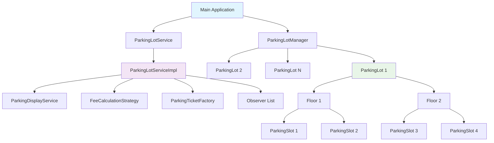
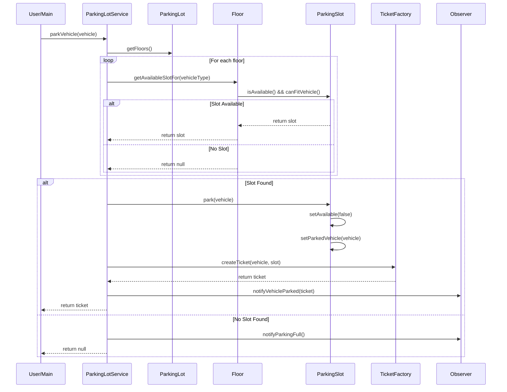
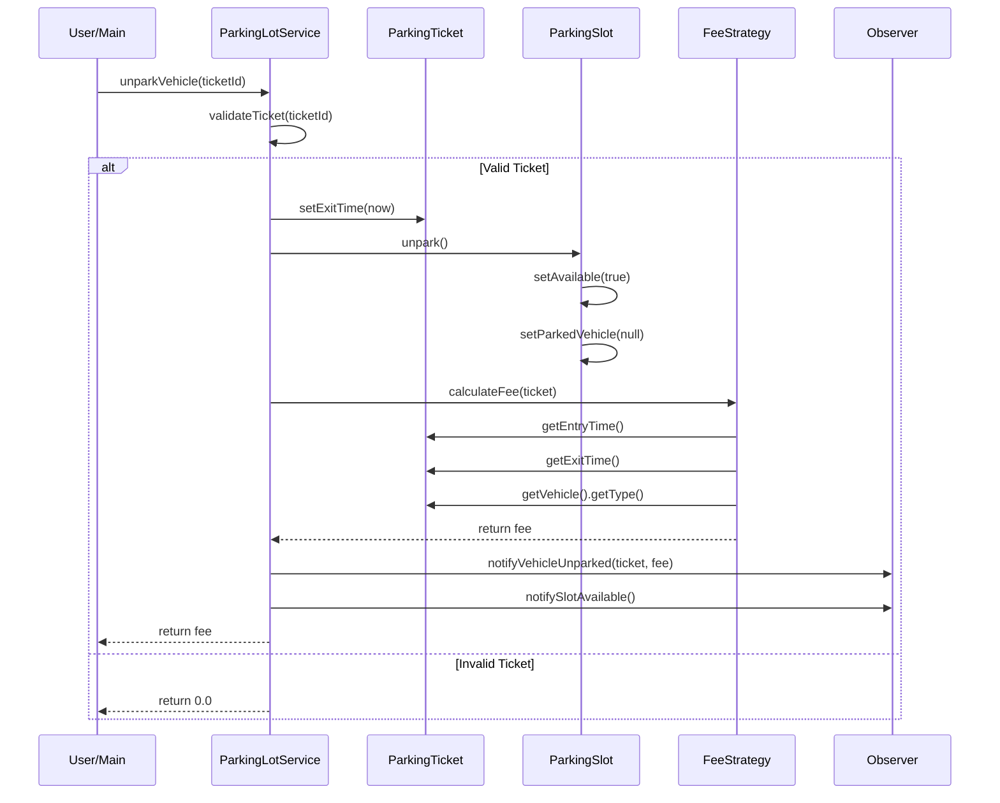
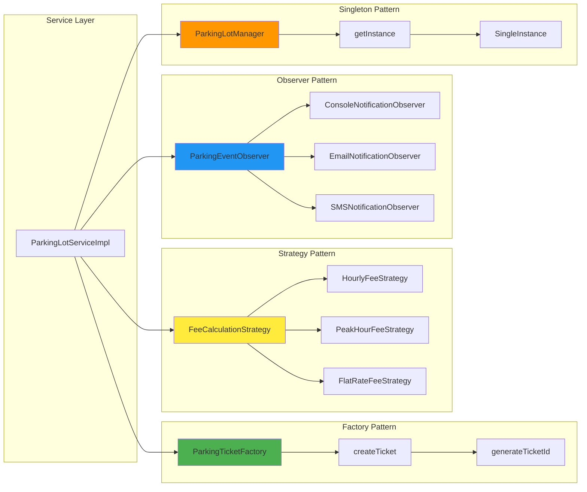
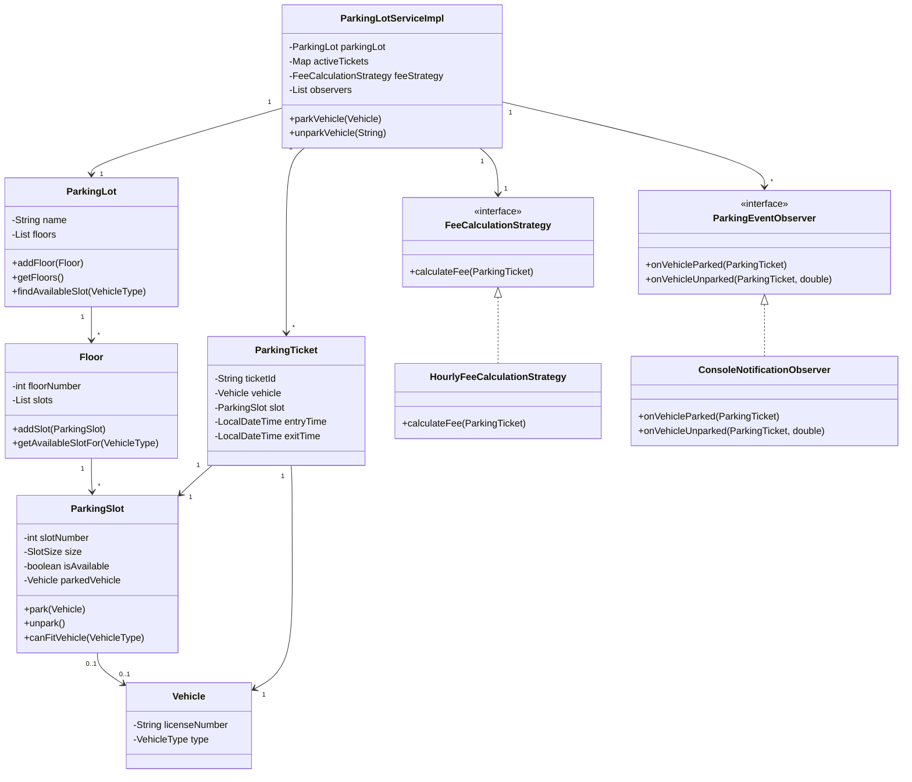
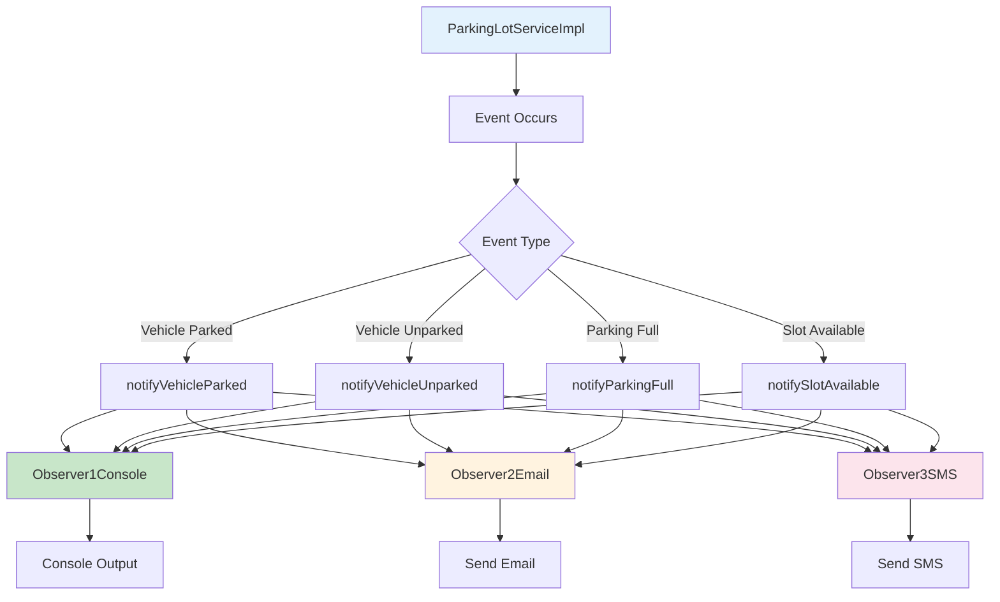
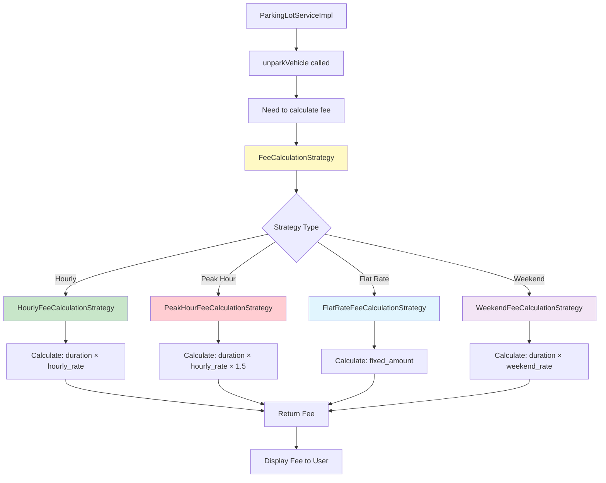
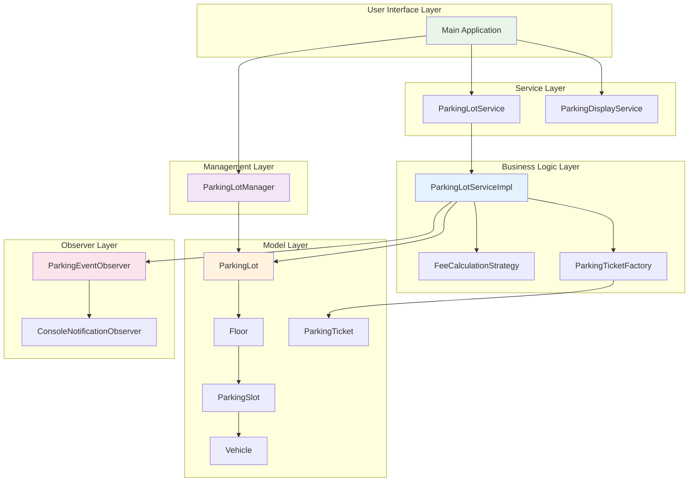
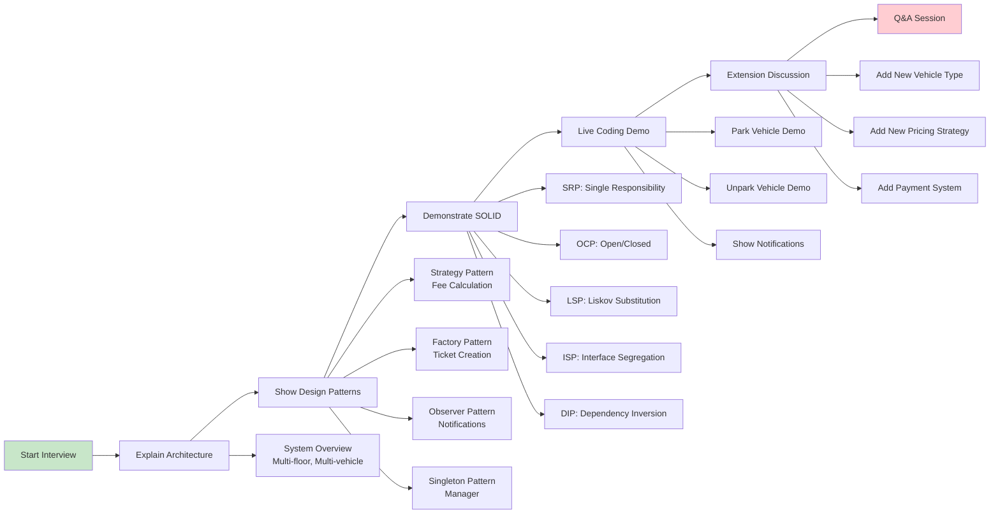

# 🔄 Parking Lot System - Flow Diagrams

## 📋 Table of Contents
1. [System Architecture Flow](#system-architecture-flow)
2. [Vehicle Parking Flow](#vehicle-parking-flow)
3. [Vehicle Unparking Flow](#vehicle-unparking-flow)
4. [Design Patterns Interaction](#design-patterns-interaction)
5. [Class Relationship Diagram](#class-relationship-diagram)
6. [Observer Pattern Flow](#observer-pattern-flow)
7. [Strategy Pattern Flow](#strategy-pattern-flow)

---

## 🏗️ System Architecture Flow

---

## 🚗 Vehicle Parking Flow

---

## 🚪 Vehicle Unparking Flow

---

## 🎯 Design Patterns Interaction

---

## 📊 Class Relationship Diagram

---

## 👁️ Observer Pattern Flow

---

## ⚡ Strategy Pattern Flow

---

## 🔄 Complete System Flow (High Level)

---

## 🎯 Interview Flow Diagram

---

## 📝 Usage Instructions

### For Interviews:
1. **Start with System Architecture Flow** - gives high-level overview
2. **Show Vehicle Parking/Unparking Flows** - demonstrates core functionality
3. **Explain Design Patterns Interaction** - shows pattern knowledge
4. **Use Class Relationship Diagram** - explains OOP concepts
5. **Reference specific flows** when answering questions

### For Development:
1. Use these diagrams to understand system flow
2. Reference when adding new features
3. Show to team members for system understanding
4. Use as documentation for future maintenance

### Mermaid Rendering:
- These diagrams use Mermaid syntax
- Can be rendered in GitHub, GitLab, or any Mermaid-compatible viewer
- For local viewing, use Mermaid Live Editor or VS Code Mermaid extension

---

**💡 Pro Tip**: During interviews, draw simplified versions of these diagrams on a whiteboard to demonstrate your understanding of system architecture and design patterns!