# 🔄 Splitwise System Flow Diagrams

## 📋 Quick Navigation
- [System Architecture Flow](#system-architecture-flow)
- [Expense Addition Flow](#expense-addition-flow)
- [Design Patterns Flow](#design-patterns-flow)
- [Balance Calculation Flow](#balance-calculation-flow)
- [Settlement Process Flow](#settlement-process-flow)

---

## 🏗️ System Architecture Flow

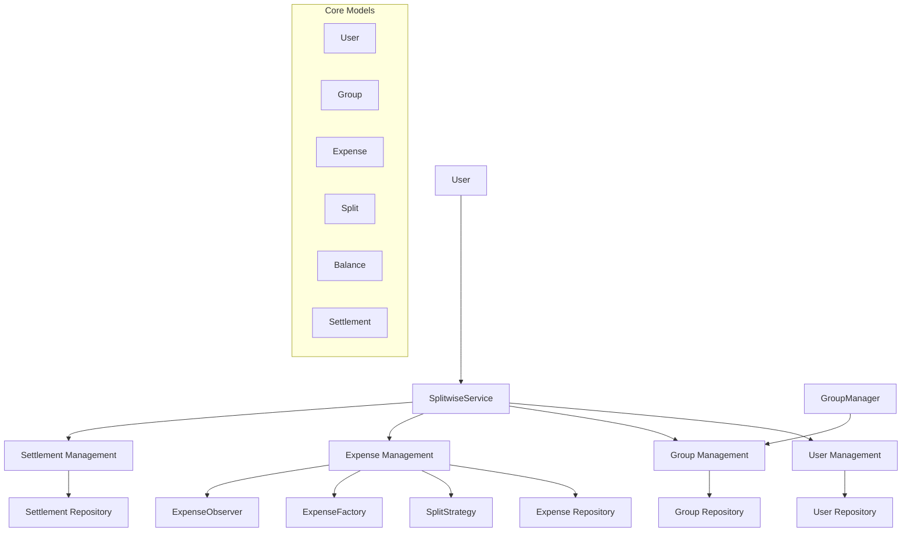

---

## 💰 Expense Addition Flow

### **Happy Path Flow:**
```
1. User Creates Expense
   ↓
2. System Validates Input
   ↓
3. System Selects Split Strategy
   ↓
4. Strategy Calculates Individual Splits
   ↓
5. System Updates User Balances
   ↓
6. System Creates Expense Record (Factory Pattern)
   ↓
7. System Notifies Observers (Observer Pattern)
   ↓
8. System Returns Expense Confirmation
```

### **Detailed Expense Addition Flow:**
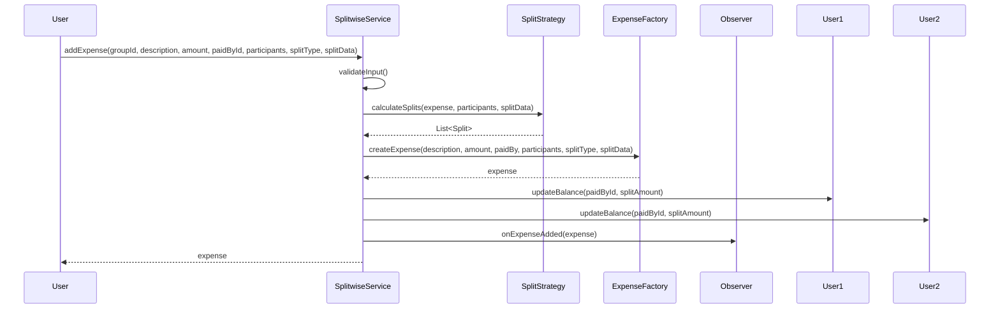

---

## 🎯 Design Patterns Flow

### **Strategy Pattern (Split Calculation):**
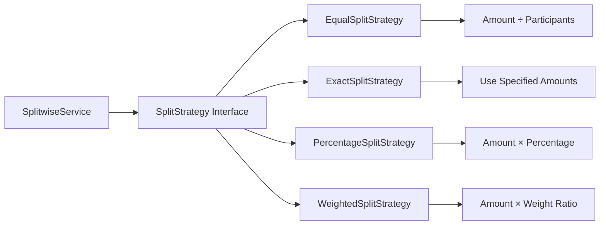

### **Factory Pattern (Expense Creation):**
```mermaid
graph TD
    A[Service Layer] --> B[ExpenseFactory]
    B --> C[Generate Expense ID]
    B --> D[Validate Split Data]
    B --> E[Create Expense Object]
    B --> F[Return Expense]
    
    C --> G[EXP-XXXXXXXX]
    D --> H[Check Sum = Total]
    E --> I[new Expense(...)]
```

### **Observer Pattern (Notifications):**
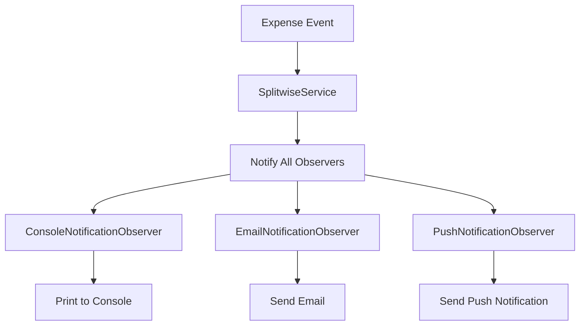

### **Singleton Pattern (Group Manager):**
```mermaid
graph TD
    A[Multiple Clients] --> B[GroupManager.getInstance()]
    B --> C{Instance Exists?}
    C -->|No| D[Create New Instance]
    C -->|Yes| E[Return Existing Instance]
    D --> F[Single GroupManager Instance]
    E --> F
```

---

## 📊 Balance Calculation Flow

### **Balance Update Process:**
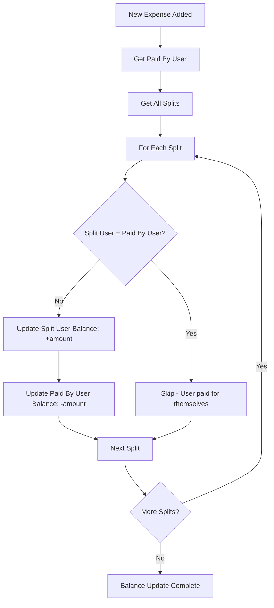

### **Balance Retrieval Flow:**
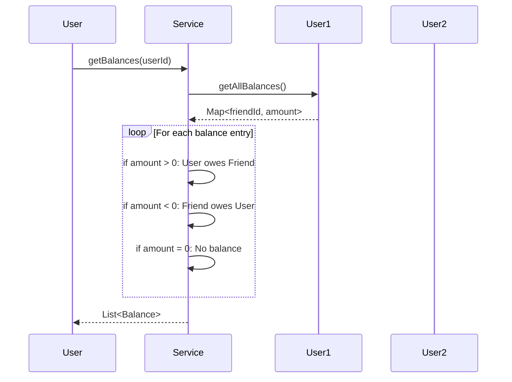

---

## 💸 Settlement Process Flow

### **Settlement Creation:**
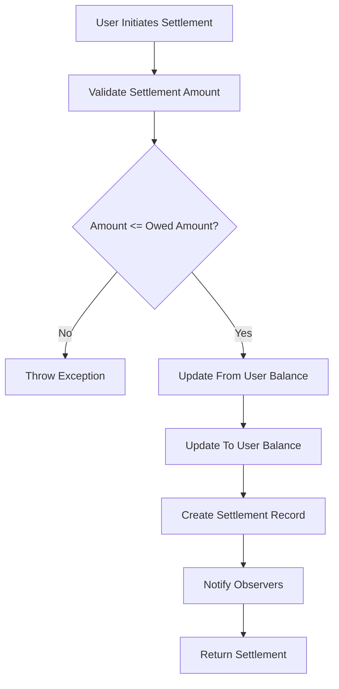

### **Settlement Optimization Flow:**
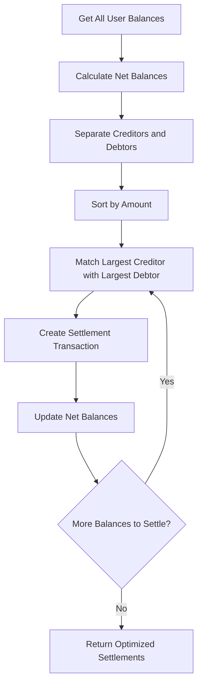

---

## 🔄 State Transition Diagrams

### **Expense State Transitions:**
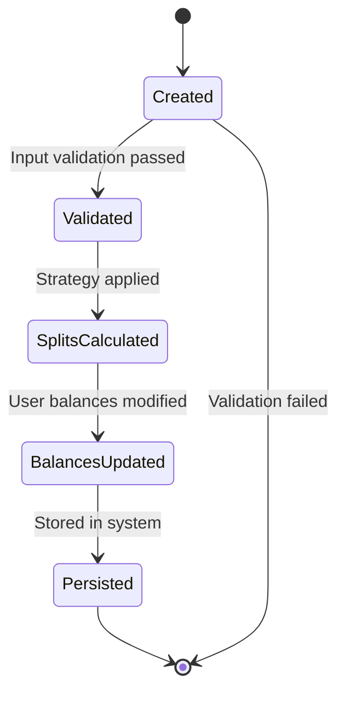

### **Settlement State Transitions:**
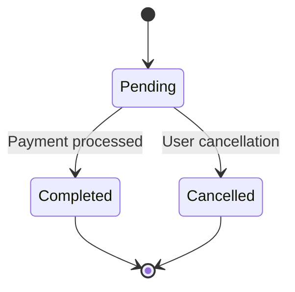

---

## 👥 Multi-User Interaction Flow

### **Group Expense Scenario:**
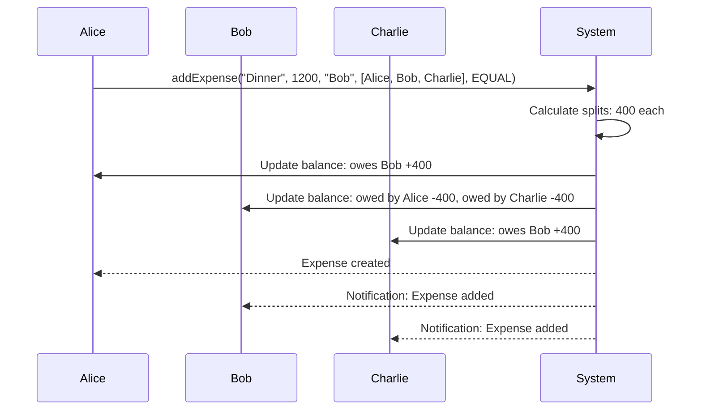

### **Settlement Between Users:**
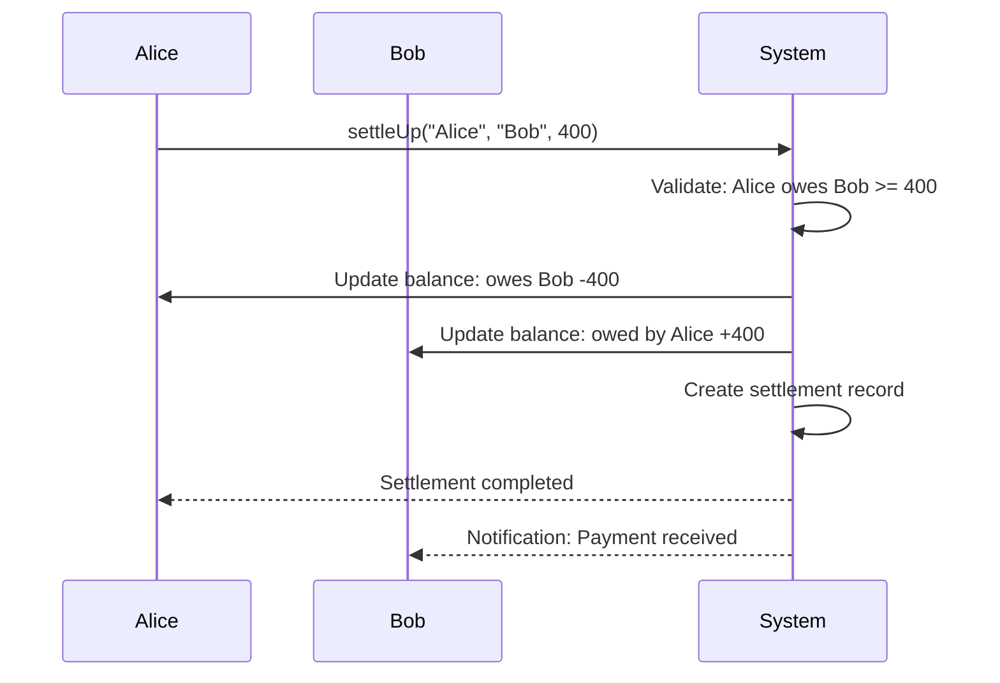

---

## 🔍 Error Handling Flow

### **Expense Addition Error Flow:**
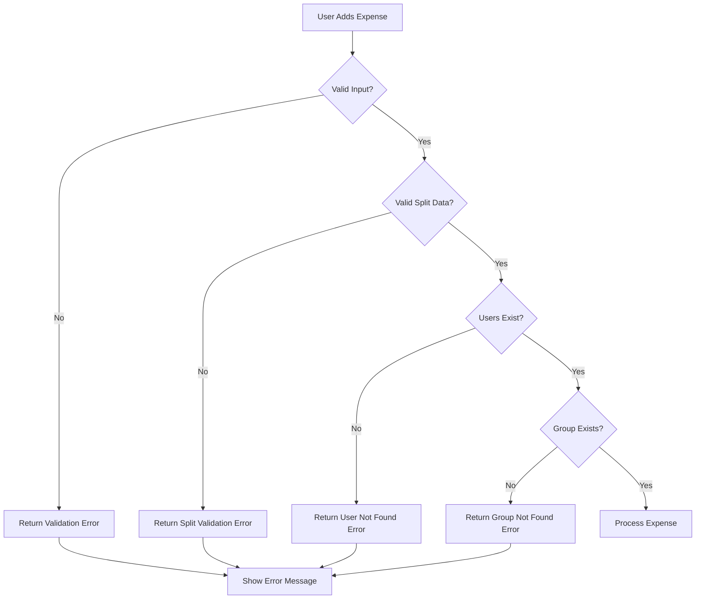

### **Settlement Error Handling:**
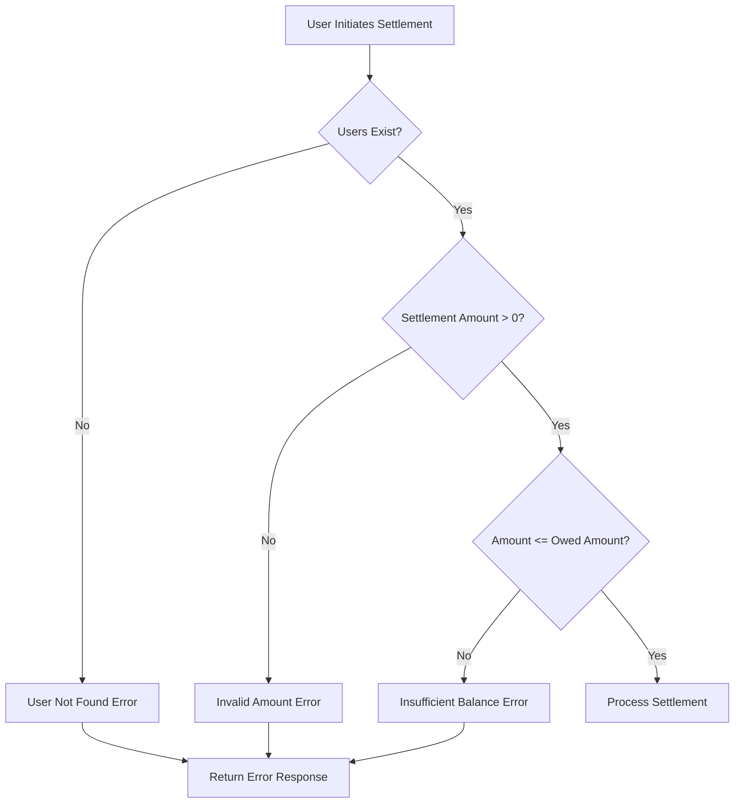

---

## 📱 Split Strategy Comparison

### **Strategy Selection Flow:**
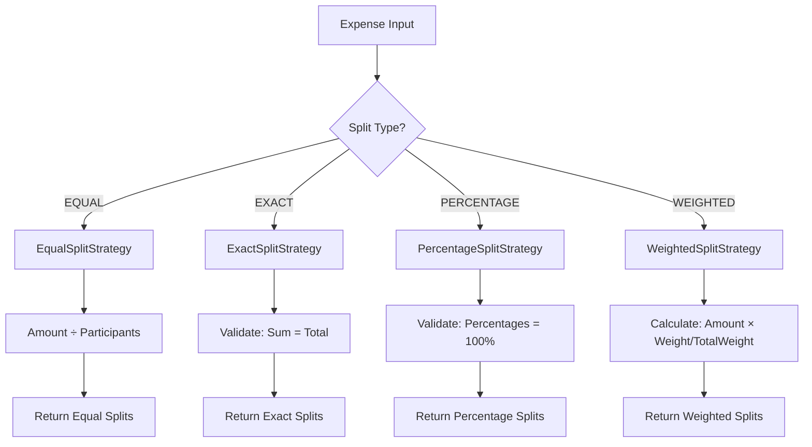

---

## 🏢 Multi-Group Architecture

### **Group Management Flow:**
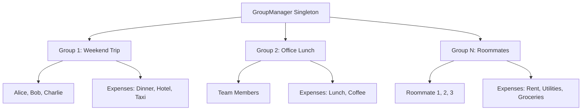

### **Cross-Group Balance Isolation:**
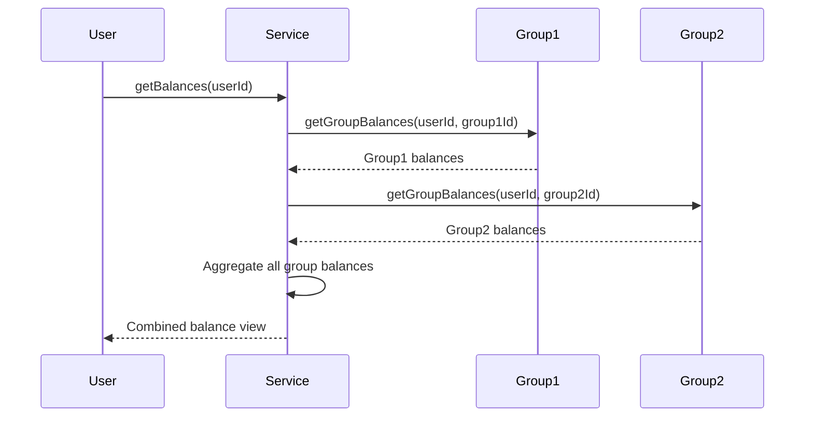

---

## 📈 Performance Optimization Flow

### **Balance Calculation Optimization:**
```mermaid
graph TD
    A[Expense Added] --> B{Use Cached Balances?}
    B -->|Yes| C[Update Only Affected Balances]
    B -->|No| D[Recalculate All Balances]
    
    C --> E[O(1) Update Operation]
    D --> F[O(n) Calculation Operation]
    
    E --> G[Update Cache]
    F --> H[Rebuild Cache]
    
    G --> I[Return Updated Balances]
    H --> I
```

**These diagrams provide a comprehensive visual understanding of the Splitwise system architecture and flows, perfect for interview discussions!**